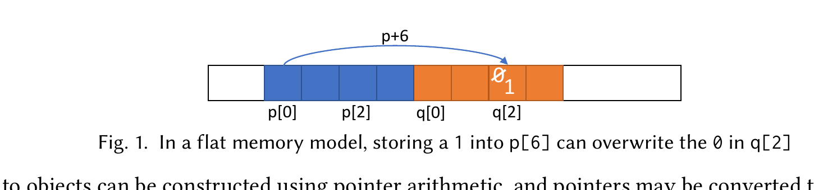
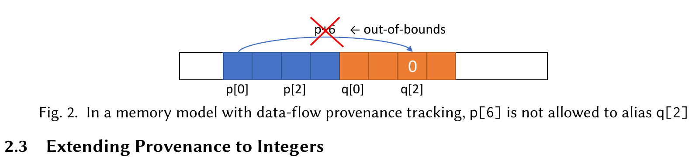
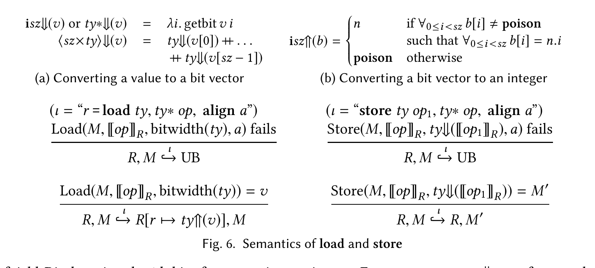
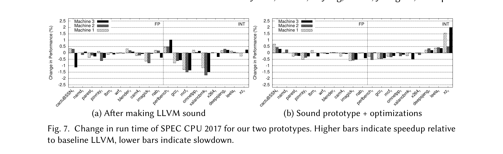
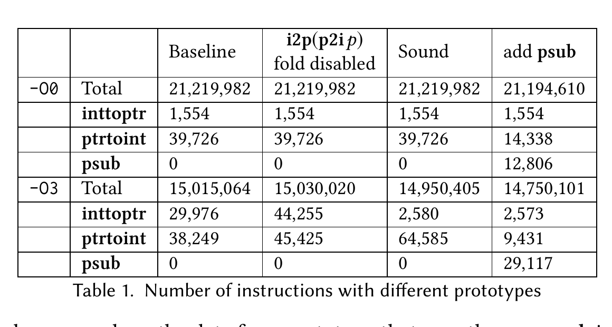
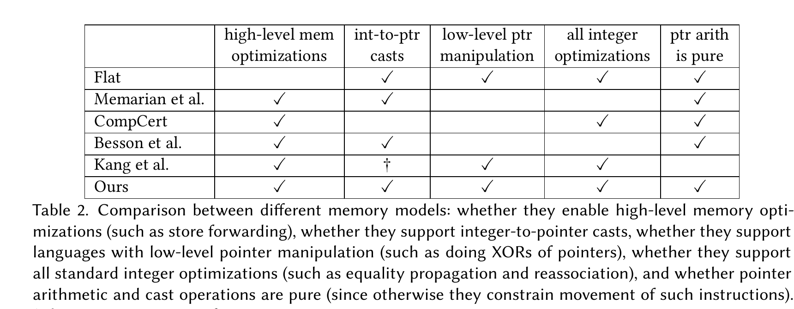

# llvmmem-oopsla18.pdf 전체 한국어 번역

## 제목 및 저자
**LLVM에서의 고수준 최적화와 저수준 코드의 조화**

JUNEYOUNG LEE, 서울대학교, 한국  
CHUNG-KIL HUR, 서울대학교, 한국  
RALF JUNG, MPI-SWS, 독일  
ZHENGYANG LIU, 유타 대학교, 미국  
JOHN REGEHR, 유타 대학교, 미국  
NUNO P. LOPES, 마이크로소프트 리서치, 영국

## 초록
LLVM은 Rust의 raw pointer나 C/C++에서의 정수와 포인터 사이 변환 같은 저수준 언어 기능을 사용하는 C, C++, Rust의 특정 프로그램을 오컴파일한다. 문제는 컴파일러가 공격적인 고수준 메모리 최적화를 구현하는 동시에, 프로그래밍 언어가 저수준 프로그램에 대해 제공하는 보장을 함께 존중하기가 어렵다는 점이다. 더 깊은 문제는 LLVM의 중간 표현(IR)을 위한 메모리 모델이 비형식적이며, 경계 사례의 의미론이 모든 컴파일러 개발자에게 항상 명확한 것은 아니라는 점이다.

우리는 LLVM IR을 위한 새로운 메모리 모델을 개발하고 이를 형식화했다. 새 모델은 문제가 있는 소수의 IR 수준 최적화를 제거할 것을 요구하지만, 이전에는 합법적이지 않았던 새로운 최적화를 추가하는 것도 지원한다. 우리는 새 모델을 구현했으며, 이것이 생성된 코드의 품질에 영향을 주지 않으면서 알려진 메모리 모델 관련 오컴파일을 수정함을 보였다.

## 1 서론
프로그래밍 언어의 메모리 모델은 프로그램이 저장 영역을 어떻게 관찰하고 수정할 수 있는지를 결정한다. 예를 들어, Java의 참조는 메모리 안의 객체를 유일하게 식별한다는 점에서 포인터와 비슷하지만, 프로그램이 객체의 중간을 가리키는 참조를 만들거나 아무 근거 없이 참조를 만들어내는 것은 허용되지 않는다. 반대로, 어셈블리 언어와 같은 진정한 의미의 저수준 프로그래밍 언어는 주소가 어떻게 계산되는지에 대해 아무 제한도 두지 않은 채 임의의 메모리 위치를 검사하고 수정할 수 있게 한다.

C와 C++는 흥미로운 틈새를 차지한다. 이 언어들은 저수준 언어로 의도되었으며, 운영체제 커널, 가상 머신 관리자, 임베디드 펌웨어, 프로그래밍 언어 런타임 등과 같은 시스템 소프트웨어는 대개 둘 중 하나로 작성된다. 이러한 응용을 지원하기 위해 객체 내부를 가리키는 포인터는 포인터 산술을 사용해 만들 수 있고, 포인터는 정수로, 정수는 다시 포인터로 변환될 수 있다. 하지만 저수준적 성격에도 불구하고 C와 C++의 메모리 모델은 고수준 기능도 함께 포함한다. 예를 들어, 컴파일러는 하나의 할당된 객체를 가리키는 포인터가 다른 객체를 가리키는 포인터를 만드는 기반으로 사용되지 않는다고, 일부 제한하에서 가정할 수 있다. C와 C++ 표준 위원회는 필요할 때는 저수준 메모리 접근을 제공하되, 그 외에는 마치 고수준 언어인 것처럼 코드를 강하게 최적화할 수 있는 능력을 유지하기를 의도한다. 이 설계 지점은 결코 쉽지 않다. 저수준 언어 기능과 고수준 언어 기능 사이의 긴장은 상당하며, 컴파일러 개발자와 응용 개발자 모두에게 문제를 일으킨다.

이 논문은 컴파일러 중간 표현(IR)을 위한 순차적 메모리 모델에 관한 것이다. IR 수준이 중요한 이유는 고수준 최적화가 이곳에서 일어나기 때문이다. GCC와 LLVM 모두 비형식적으로만 명세된 메모리 모델을 가지고 있으며, 그 안에는 저수준 프로그램의 종단 간 오컴파일로 이어지는 문제가 들어 있다. 부록 A는 GCC와 LLVM이 모두 오컴파일하는 C 프로그램을 보여준다. 그러나 우리가 다루는 문제는 C와 C++에만 국한되지 않는다. 부록 B는 LLVM이 오컴파일하는 저수준이지만 안전한 Rust 함수를 보여준다. 원인은 우리가 LLVM의 global value numbering(GVN) 최적화에서 발견한 새로운 버그다. GVN은 분기 조건에서 포인터의 동치성(정수의 동치성과 마찬가지로)을 전파하여, 포인터를 값이 같은 다른 포인터로 바꾼다. 그러나 이는 프로그램의 동작을 바꿀 수 있는데, 같다고 비교되는 포인터가 반드시 동등한 것은 아니기 때문이다. C 예제의 오컴파일은 LLVM이 `(int*)(intptr_t)p`가 `p`와 같다고 잘못 가정하는 또 다른 버그로까지 거슬러 올라갈 수 있다.

현재 IR 의미론 안에서 이런 오컴파일을 고치는 것은 가능하겠지만, 그러려면 유용한 최적화를 비활성화해야 한다. [Kang et al. 2015]가 발전시킨 통찰을 바탕으로 한 우리의 주요 기여는, 현재 설계에서 두 가지 점이 다른 LLVM용 새로운 형식화된 IR 메모리 모델이다. 첫째, 이 모델은 지연 경계 검사(deferred bounds checking)를 사용하여 범위 밖 포인터 생성에 대한 제한을 완화함으로써 유용한 코드 이동 최적화를 건전하게 수행할 수 있게 한다. 둘째, 이 모델은 포인터의 값은 직접 관찰되어야 하며 추측될 수 없다는 생각을 형식화한 트윈 할당(twin allocation)을 사용한다. 트윈 할당은 정수에서 포인터로의 캐스트 같은 저수준 코드가 존재하는 상황에서도 LLVM 기반 언어의 공격적인 최적화를 지원한다. 우리는 이 새로운 의미론에 맞추어 LLVM을 수정했으며, 그 결과 이것이 컴파일러에 큰 변화를 요구하지도 않고 생성 코드의 성능도 떨어뜨리지 않음을 보였다.

## 2 배경: 중간 표현을 위한 메모리 모델
이 절에서는 저수준 순차 메모리 모델의 설계 공간을 설명하고, 기존 설계들이 저수준 메모리 접근과 고수준 최적화 사이의 긴장을 관리하기에 불충분함을 설명한다. 이어서 3절에서는, 4절에서 형식화할 LLVM IR용 새로운 메모리 모델의 기초를 설명한다. 예제는 읽기 쉽게 하기 위해 C와 유사한 문법으로 작성했지만, 이 논문의 범위는 C가 아니라 컴파일러 IR을 위한 메모리 모델을 명세하는 것이다.

### 2.1 평면 메모리 모델
메모리 모델이 답해야 할 두 가지 핵심 질문은 (1) load 명령의 반환값이 무엇인가, 그리고 (2) 메모리에 접근하는 명령이 어떤 조건에서 잘 정의되는가이다. 그 결과로, 메모리 모델은 store 명령이 어떤 메모리 위치에 기록하는지도 정의해야 한다.

예를 들어, 아래 코드는 무엇을 출력하는가? 혹은 다른 말로 하면, `p[6] = 0`이라는 대입이 `q`가 가리키는 객체의 어떤 바이트라도 바꿀 수 있는가?

```c
char *p = malloc(4);
char *q = malloc(4);
q[2] = 0;
p[6] = 1;
print(q[2]); // 0 또는 1을 출력?
```

평면 메모리 모델에서는 `q == p + 4`이면 이 프로그램이 1을 출력하고, 그렇지 않으면 0을 출력한다. 평면 메모리 모델은 포인터를 정수처럼 취급한다. 즉, 메모리에 접근하는 명령은 메모리 안의 어떤(보호되지 않은) 위치든 접근할 수 있으며, 따라서 프로그램은 객체의 위치를 추측해도 된다(그림 1). 일부 어셈블리 언어는 평면 메모리 모델을 가지며, 세그먼트 메모리를 사용하는 기계를 위한 언어들처럼 그렇지 않은 것들도 있다.

평면 메모리 모델은 개념적으로 단순하고 저수준 프로그래밍과 잘 맞지만, 현대 컴파일러에서 일상적으로 수행되고 필수적인 것으로 여겨지는 고수준 최적화를 방해한다.



그림 1. 평면 메모리 모델에서는 `p[6]`에 1을 저장하면 `q[2]`에 있는 0을 덮어쓸 수 있다.

### 2.2 데이터 흐름 기반 기원 정보 추적
앞선 예제에서 우리는 메모리 할당기가 할당된 블록들을 어디에 배치하느냐에 따라 프로그램이 0 또는 1을 출력할 수 있음을 보였다. 할당기의 실행 시 동작에 대한 이러한 의존성은 컴파일러를 과도하게 제약하여, store forwarding과 같은 중요한 최적화를 수행하지 못하게 막는다. 예를 들어, 우리는 컴파일러가 `q[2] = 0`이라는 store를 `print` 명령까지 전파할 수 있기를 원한다. 따라서 메모리 모델은 실행 시점에 `p`와 `q`가 어디를 가리키게 되든, `p[6]`에 대한 store가 `q[2]`에 접근하지 못하게 하는 방법이 필요하다. 예를 들어, 이러한 효과를 내는 규칙은 C89 이래로 C의 일부였다.

데이터 흐름 기반 기원 정보 추적은, 서로 무관한 객체로부터 파생된 포인터를 통해 객체에 접근하는 일을 막는 방법을 제공한다. 핵심 아이디어는 각 포인터가 두 값의 쌍이라는 것이다. 하나는 그것이 가리킬 수 있는 객체이고, 다른 하나는 메모리 주소(또는 그 객체 내부의 오프셋)이다. 자신의 객체 범위를 벗어난 포인터로 메모리에 접근하려 하면 이는 정의되지 않은 동작(UB)이다. 이 의미론이면, 실행 시점에는 둘이 같은 위치를 가리키게 될 수 있다는 사실과 무관하게 컴파일러가 `p[6]`은 `q[2]`에 접근할 수 없다고 결론 내리기에 충분하다.

데이터 흐름 기반 기원 정보 추적은 다음처럼 정의할 수 있다.

```c
char *p = malloc(4);         // (val=0x10, obj=p)
char *q = malloc(4);         // (val=0x14, obj=q)
char *q2 = q + 2;            // (val=0x16, obj=q)
char *p6 = p + 6;            // (val=0x16, obj=p)

*q2 = 0; // 정상
*p6 = 1; // UB, obj p의 범위를 벗어났기 때문
print(*q2); // print(0)으로 대체 가능
```

`q2`를 통한 첫 번째 store는 객체 `q`의 경계 안에 있으므로 성공한다. 하지만 두 번째 store는 포인터가 자신의 기반 객체 `p`의 범위를 벗어나 있기 때문에 UB를 일으킨다. 실행 시점에 프로그램이 유효한 객체의 주소를 정확히 추측했다는 사실은 이 결론을 바꾸지 않는다(그림 2). 마지막으로, 그 사이에 잘 정의된 store 명령이 없으므로 컴파일러는 `*q2 = 0`이라는 store를 `print` 명령으로 안전하게 전파할 수 있다.



그림 2. 데이터 흐름 기반 기원 정보 추적이 있는 메모리 모델에서는 `p[6]`이 `q[2]`와 alias하는 것이 허용되지 않는다.

### 2.3 정수로의 기원 정보 확장
앞 절에서 보인 모델은 정수에서 포인터로의 캐스트 같은 저수준 언어 기능을 지원하지 않는다. 이 기능을 지원하기 위해 우리는 정수에도 기원 정보(provenance)를 확장해 붙일 수 있다.¹

```c
char *p = malloc(4); // (val=0x10, obj=p)
char *q = (int*)0x10; // (val=0x10, obj=nil)

*q = 0; // UB, obj=nil이기 때문
if (p == q)
    *q = 1; // 여전히 UB; obj=nil

int v = (int)p;                      // (val=0x10, obj=p)
int w = v + 2;                       // (val=0x12, obj=p)

*(char*)w = 3;           // 정상

char *r = malloc(4);           // (val=0x14, obj=r)
int x = v + (int)r;            // (val=0x24, obj=??)
int y = x - (int)r;            // (val=0x10, obj=??)
```

이 모델에서는 각 정수 변수와 포인터 변수가 수치 값 하나와, 그것이 가리키는 객체 하나를 함께 추적한다. 가리키는 객체가 없으면 `nil`이다. 앞선 모델과 마찬가지로, 객체의 주소는 정수 변수에 저장되어 있더라도 어떤 객체로부터 파생되어야 한다. 따라서 `q`를 통한 store들은 UB다. 반면 `w`를 통한 접근은 이 정수 변수의 값이 유효한 객체로부터 데이터 흐름 관점에서 파생되었으므로 잘 정의된다. 예제의 마지막 줄들은 정수 산술 연산을 수행할 때 기원 정보 추적이 무너진다는 점을 보여준다. 이런 경우들에 의미 있는 의미론을 부여하기는 어렵다.

이 모델의 단점 하나는, 실제로는 치명적일 정도로, 많은 정수 최적화를 막는다는 점이다. 예를 들어 global value numbering(GVN)이나 범위 분석이 수행하는 동치성 전파 같은 최적화가 여기에 해당한다. 예를 들어, `"(a == b) ? a : b"`를 `"b"`로 바꾸는 것은 이 모델에서는 올바르지 않다. 두 정수 변수가 값 비교에서 같더라도, 서로 다른 기원 정보를 가질 수 있기 때문이다. 이 문제를 보여주는 더 완전한 예제를 들어 보자.

```c
char *p = malloc(4); // (val=0x10, obj=p)
char *q = malloc(4); // (val=0x14, obj=q)
int v = (int)p + 4;          // (val=0x14, obj=p)
int w = (int)q;              // (val=0x14, obj=q)

if (v == w)
    *(int*)w = 2;
```

이 프로그램에서 `v`와 `w`는 우연히 같은 값을 갖지만, 기원 정보는 서로 다르다. 따라서 `*(int*)w = 2`를 `*(int*)v = 2`로 바꾸는 것은 안전하지 않다. 그렇게 하면 UB가 도입되는데, `"v"`는 객체 `p`에만 접근할 수 있고 그 오프셋은 범위를 벗어나 있기 때문이다. 하지만 이러한 종류의...

¹ 간단히 쓰기 위해, 여기서 `int`는 포인터를 담기에 충분히 큰 정수형을 나타내는 것으로 사용한다.


하지만 이러한 종류의 동치성 전파는 GVN이 일상적으로 수행하는 작업이다. 실제로 GVN이 수행한 이와 유사한 변환이 부록 B에 나온 Rust 코드를 오컴파일한 원인이었다.

## 2.4 와일드카드 기원 정보
앞선 메모리 모델은 저수준 연산을 지원하고 고수준 메모리 최적화를 가능하게 한다는 장점이 있다. 하지만 이제 정수 변수도 기원 정보를 지니므로, 일부 정수 최적화가 건전하지 않게 된다. 이 문제를 해결하는 한 가지 방법은 다음과 같이 정수 변수에서 기원 정보를 제거하는 것이다.

```c
char *p = malloc(4);           // (val=0x10, obj=p)
char *q = malloc(4);           // (val=0x14, obj=q)
int v = (int)p + 4;            // (val=0x14)
int w = (int)q;                // (val=0x14)

if (v == w) {
    char *r = (int*)w;         // (val=0x14, obj=*)
    *r = 2;
}
```

앞 절의 예제와 다른 점은 (1) 정수는 오직 수치 값만 지닌다는 점, 그리고 (2) 정수에서 캐스팅해 얻은 포인터는 임의의 객체(여기서는 `*`로 표시됨)에 접근할 수 있다는 점이다. 따라서 `v`와 `w`는 서로 바꾸어 쓸 수 있고, 정수에 대한 GVN은 다시 건전해진다. 그러나 이 모델에는 큰 단점이 있다. 컴파일되는 프로그램이 정수에서 포인터로의 캐스트를 단 한 번이라도 수행하는 순간, 정밀한 alias 분석이 매우 어려워진다. 다음 절들에서는 이 정밀도를 어떻게 회복할 수 있는지 살펴본다.

## 2.5 inbounds 포인터
앞 절에서는 와일드카드 기원 정보가 있는 모델을 제시했다. 이 모델은 동작은 하지만 정밀한 alias 분석을 방해한다. 이 절에서는 포인터 산술이 선택적으로 `inbounds`가 되는 LLVM의 현재 모델을 설명한다. 이 모델은 범위를 벗어난 포인터 산술을 정의되지 않은 것으로 만듦으로써 일부 정밀도를 회복하게 해준다.

```c
char *p = malloc(4); // (val=0x10, obj=p)
char *q = foo(p);    // (val=0x13, obj=p)
char *r = q +inb 2;  // poison: 0x15는 p의 범위를 벗어남

p[1] = 0;
*r = 1;                    // UB
print(p[1]);               // 0 또는 1을 출력?
```

`inbounds` 포인터 산술(`+inb`)을 할 때는 기반 포인터와 결과 포인터가 같은 객체의 경계 안에 있어야 한다(혹은 그 끝 바로 다음 한 칸이어야 한다). `r`은 이 조건을 만족하지 않으므로, 그 연산 결과는 `poison`이 되고, 이 포인터를 역참조하면 UB가 된다 [LangRef 2018].

컴파일러가 `q`의 값을 모르더라도, `inbounds` 포인터 산술 때문에 이제 `r`의 최소 오프셋이 2여야 한다는 사실은 알 수 있다. 왜냐하면 `q`와 `r`은 둘 다 같은 객체의 경계 안에 있어야 하기 때문이다(즉 `0 ≤ o_q ≤ n` 그리고 `0 ≤ o_r ≤ n`, 여기서 `o_q`와 `o_r`은 각각 객체 내부에서 `q`와 `r`의 오프셋이고, `n`은 객체 크기다). `p[1]`에 대한 접근은 객체의 오프셋 1에만 접근하고, `*r`은 오프셋 2 이상에만 접근할 수 있으므로, 컴파일러는 이 두 접근이 alias하지 않는다고 결론 내릴 수 있다(즉 프로그램은 항상 0을 출력한다).

## 3 LLVM을 위한 메모리 모델
이 절에서는 다음과 같은 수정된 IR 수준 메모리 모델을 비형식적으로 설명한다. 이 모델은 저수준 코드를 계속 지원하면서도 고수준 최적화를 가능하게 하고, 포인터 산술 명령의 이동을 제한하지 않으며(즉 이 명령들은 순수 함수로 남는다), 표준적인 정수 최적화를 전혀 방해하지 않는다. 4절에서는 이 새 모델을 형식화한다.

### 3.1 지연 경계 검사
LLVM의 현재 `inbounds` 포인터 검사의 단점은 포인터 산술 명령과 할당 함수의 재배치를 막는다는 점이다.

```c
char *p = malloc(4);        // (val=0x10, obj=p)
char *q = malloc(4);        // (val=0x14, obj=q)

char *r = (char*)((int)p + 5); // (val=0x15, obj=*)
char *s = r +inb 1;            // poison: 0x15는 p의 범위를 벗어남
*s = 0; // 정상
```

이 예제에서 `s`는 유효한 포인터다. 즉, 어떤 객체의 경계 안에 있다. 하지만 `r`과 `s`의 정의를 `q`의 정의 앞쪽으로 옮기면, `s`는 범위를 벗어나게 되고 따라서 `poison`이 할당된다.²

명령의 이동을 제약하는 것은 바람직하지 않다. code hoisting 같은 최적화를 방해하기 때문이다. 실제로 LLVM은 포인터 산술 명령을 자유롭게 이리저리 이동시킨다. 이것은 건전하지 않다. 우리의 새 모델은 LLVM의 현재 즉시 경계 검사(immediate bounds checking)와 달리 지연 경계 검사(deferred bounds checking)를 사용함으로써 이 문제를 해결한다.

지연 경계 검사에서는 범위를 벗어난 포인터가 생성되고 조작되는 것을 허용한다. 정의되지 않은 동작은 그런 포인터가 역참조될 때에만 발생한다. 이제 앞선 예제에서는 포인터 산술을 할당 함수 너머로 재배치해도 괜찮다.

```c
char *p = malloc(4);                    // (val=0x10, obj=p)

char *r = (char*)((int)p + 5);          // (val=0x15, obj=*)
char *s = r +inb 1;                     // (val=0x16, obj=*, inb={0x15,0x16})

char *q = malloc(4);                    // (val=0x14, obj=q)

*s = 0; // 0x15와 0x16이 같은 객체의 경계 안에 있으므로 정상
```

이제 `obj=*`인 포인터에 대해서는, 그 포인터가 역참조될 때 반드시 같은 객체의 경계 안에 있어야 하는 주소들의 집합을 추적한다. `inbounds` 포인터 산술 연산이 일어날 때마다, 우리는 `inb` 필드에 기반 포인터와 결과 포인터를 모두 기록한다. 메모리 접근 연산은 `inb` 안의 주소들이 모두 같은 객체의 경계 안에 있지 않다면 UB다. 따라서 `inbounds` 검사는 포인터가 역참조될 때까지 미뤄진다. 지연 경계 검사는 즉시 경계 검사와 같은 효과를 달성하면서도, 포인터 산술 명령이 이제 메모리 상태에 의존하지 않기 때문에 자유롭게 이동할 수 있게 해 준다.

정밀도를 더 높이는 방법도 있을 수 있다. 예를 들어 `*` 기원 정보를 캐스트된 포인터가 실제로 가리키는 객체(들)로 대체하는 것이다. 위 첫 번째 예제에서는 `r`을 대신 `(val=0x15, obj=q)` 값을 갖도록 정의할 수 있다. 그러나 이것 또한 같은 이동 제약을 갖는 즉시 경계 검사의 한 형태다. 게다가 예제에서의 `0x14`처럼 어떤 주소는 두 객체의 경계 안에 동시에 들어갈 수도 있다(`p + 4`와 `q`에 해당). 이는 모델을 더 복잡하게 만든다. 따라서 우리는 그런 의미론을 사용하지 않는다.

² 이 예제는 데이터 흐름 기반 기원 정보 추적을 사용하는 메모리 모델에서는 올바르지 않지만, 우리 모델에서는 괜찮다는 점에 유의하라. `p`를 바탕으로 `q` 안을 가리키는 포인터를 만들고 있긴 하지만, 이것은 컴파일러가 `p == q + 4`라는 등식을 전파한 결과일 수도 있다.

### 3.2 주소 추측 방지
이 절에서는 트윈 할당(twin allocation)을 소개한다. 이는 데이터 흐름 기반 기원 정보 추적 없이도 우리 모델이 프로그램의 객체 주소 추측을 막을 수 있게 해 주는 기법이다.

와일드카드 기원 정보의 문제는, 정수로부터 만들어진 포인터가 어떤 객체든 접근할 수 있다는 점이다. 그 결과 프로그램은 임의의 객체의 주소를 추측해 접근할 수 있게 될 수도 있다. 이는 정밀한 alias 분석을 매우 어렵게 만든다.

추측을 막는 한 가지 단순한 아이디어는, 할당 함수가 비결정적인 값을 반환한다는 사실을 활용하는 것이다.

```c
char *p = malloc(4); // (val=*, obj=p)
char *q = 0x10;
*q = 0; // val(p) != 0x10 이면 UB
```

이 프로그램은 `malloc`이 `0x10`을 반환하는 실행에서는 `p`의 주소를 추측할 수 있다. 하지만 프로그램이 `p`의 주소를 맞히지 못하는 실행도 적어도 하나는 존재한다(예를 들어 `malloc`이 `0x20`을 반환하는 경우). 그 경우 이 프로그램은 UB를 일으킨다. 적어도 하나의 실행에서 프로그램이 UB를 일으킨다면, 컴파일러는 `q`가 `p`와 alias할 수 없다고, 더 나아가 어떤 객체와도 alias할 수 없다고 가정할 수 있다.

비결정적 할당이 있더라도, 프로그램은 여전히 어떤 객체의 주소를 관찰할 수 있고, 그렇게 되면 정수에서 캐스팅하여 만든 포인터가 그 객체와 alias할 수 있게 된다. 예를 들어 다음과 같다.

```c
char *p = malloc(4); // (val=*, obj=p)
*p = 0;
int v = 0x10;
if ((int)p == v)
    *(int*)v = 1;
print(*p); // 0 또는 1을 출력할 수 있음
```

이 프로그램은 잘 정의되어 있으며, `malloc`의 반환값에 따라 0 또는 1을 출력할 수 있다. 비교 연산만으로도 프로그램은 객체 `p`의 주소를 관찰하게 되므로, `*(int*)v = 1`은 어떤 실행에서도 UB를 일으키지 않는다.

하지만 이 의미론에도 한 가지 허점이 있다. 이 의미론은 프로그램이 “side-channel leak”를 통해 주소를 추측할 수 있게 해 준다. 이 누수는 메모리에 새 객체를 할당할 수 있는 주소가 단 하나만 남았을 때 발생한다. 예를 들어, 어떤 시스템이 8비트 힙 세그먼트와 8비트 포인터를 가지고 있고, 힙 주소 `0x00`이 합법적이며, 아래 할당들이 모두 성공한다고 가정하자.

```c
char *p = malloc(0x80);
char *q = malloc(0x80);

*q = 0;
int v = ((int)p == 0x00) ? 0x80 : 0x00;
*(char*)v = 1;

print(*q); // 1을 출력
```

각 힙 셀이 주소 공간의 절반 크기이므로, 가능한 힙 구성은 `p-first`와 `q-first` 두 가지뿐이다. 따라서 단 한 번의 테스트만으로도 프로그램은 `q`의 주소를 명시적으로 관찰하지 않고도 맞혀낼 수 있다. 즉, 메모리가 유한할 때는 할당 함수가 비결정적인 값을 반환하는 것만으로는 프로그램의 주소 추측을 막기에 충분하지 않다.


그림 3. 메모리 구성: (a) 두 바이트만 남아 거의 꽉 찬 상태, (b) (a)에서 `p`와 `q`를 할당한 뒤의 상태, (c) (a)에서 트윈 할당 의미론으로 `p`를 할당한 뒤의 상태, (d) 트윈 할당이 두 객체 모두에 대해 충분한 공간을 가졌던 대안적 구성.

우리의 해법은, 실제 런타임 구현에서 그러듯이, 할당 함수가 하나의 블록이 아니라 적어도 두 개의 블록을 예약하도록 바꾸는 것이다. 우리는 이 기법을 트윈 할당이라고 부르며, 프로그램이 객체의 주소를 추측할 수 없다는 개념을 형식화하는 데 이것을 사용한다.

트윈 할당의 개념은 다음 예제로 비형식적으로 설명할 수 있다.

```c
char *p = malloc(1);
char *q = malloc(1);

*q = 0;
int v = (int)p + 1;           // q와 같은가?
*(char*)v = 1;

print(*q); // 0 또는 1을 출력?
```

`q`의 주소는 관찰되지 않았으므로, 우리는 컴파일러가 이 프로그램은 오직 0만 출력할 수 있다고 결론 내릴 수 있기를 바란다. 그러나 앞에서 보았듯이 메모리가 가득 차 있으면, 한 객체의 주소를 관찰하는 것만으로도 다른 객체의 주소가 암묵적으로 드러날 수 있다. 그림 3(a)는 할당 전에 가능한 메모리 구성 하나를 보여 주고, (b)는 `p`와 `q`를 할당한 뒤의 구성을 보여 준다.

트윈 할당에서는 각 할당 함수가 적어도 두 개의 블록을 예약한다. 비결정적으로 그중 하나의 블록이 사용되고 그 주소가 반환되며, 나머지 블록들은 도달 불가능한 것으로 표시된다(즉, 그 메모리 영역에 접근하면 UB다). 두 개의 블록을 예약함으로써, 메모리가 가득 차 있더라도 프로그램이 어떤 블록의 주소를 추측할 수 없을 만큼의 비결정성이 남아 있음을 보장한다.

그림 3(c)는 트윈 할당을 사용하면 앞선 예제가 단순히 메모리 부족에 걸리게 되고, 따라서 프로그램이 계속 실행되어 `q`의 주소를 추측하려고 시도할 수 없음을 보여 준다. (d)는 남은 공간이 각 할당마다 두 블록씩 할당하기에 딱 충분했던 또 다른 메모리 구성을 보여 준다. 객체마다 두 블록이 있으므로 `malloc`은 여전히 두 주소 중 하나를 비결정적으로 반환할 수 있고, 이는 프로그램이 객체의 주소를 추측하는 것을 효과적으로 막는다. 프로그램이 가령 `p1`의 주소를 추측할 수 있다고 하더라도(심지어 `p2`까지도), 남아 있는 주소들 가운데 어느 것이 `q`를 가리키는지는 추측할 수 없다. 즉 `q1`과 `q2` 중 어느 것이 실제로 사용되었는지 알 수 없기 때문이다.

### 3.3 요약
우리는 LLVM IR을 위한 메모리 모델을 비형식적으로 제시했다. 고수준 최적화와 저수준 코드를 모두 지원하기 위해, 우리는 포인터를 두 범주로 나눈다. 첫째는 할당 지점에서 파생되는 논리 포인터(logical pointers)로, 이에 대해서는 데이터 흐름 의존성 추적을 수행한다. 즉, `p`에서 포인터 산술 연산으로 얻어진 포인터 `q`(예: `q = p + x`)는 `p`와 같은 객체에만 접근할 수 있다. 둘째는 정수에서 포인터로의 캐스트로부터 파생되는 물리 포인터(physical pointers)로, 이에 대해서는 데이터 흐름 의존성 추적을 수행하지 않는다. 그렇게 하면 등가성 전파 같은 표준 정수 최적화가 막히기 때문이다. 대신 우리는 정밀도를 회복하기 위해 두 가지 새로운 기법을 사용한다. 지연 경계 검사(포인터가 가리킬 수 있는 객체 집합을 제한하면서도 포인터 산술 연산은 순수하게 유지하기 위해)와 트윈 메모리 할당(주소 추측을 방지하기 위해)이다.


앞 페이지에서 이어짐:

우리는 이에 대해 데이터 흐름 의존성 추적을 수행하지 않는데, 그렇게 하면 등가성 전파 같은 표준 정수 최적화가 막히기 때문이다. 대신 우리는 정밀도를 회복하기 위해 두 가지 새로운 기법을 사용한다. 지연 경계 검사(포인터 산술 연산을 순수하게 유지하면서 포인터가 가리킬 수 있는 객체 집합을 제한하기 위한 것)와 트윈 메모리 할당(주소 추측을 방지하기 위한 것)이다.

## 4 의미론과 변환
이 절에서는 3절에서 비형식적으로 제시한 LLVM용 수정 메모리 모델을 형식적으로 제시한다. 우리의 최상위 설계 목표는 정수와 포인터 사이의 캐스팅처럼 C와 C++에 필요한 저수준 연산을 지원하면서도, 동시에 고수준 메모리 최적화도 가능하게 하는 것이었다. 추가 목표는 다음과 같았다. 정수 최적화를 방해하지 않을 것, 코드 이동 기회를 제한하지 않을 것, LLVM이 새로운 모델을 따르도록 만드는 데 큰 변화가 필요하지 않을 것, 마지막으로 컴파일 시간과 생성 코드 품질에서 의미 있는 퇴보를 피할 것.

## 4.1 논리 포인터와 물리 포인터
2.4절에서 보았듯이, 우리는 두 종류의 포인터를 갖는다. 논리 포인터는 할당 함수를 호출하거나, 논리 포인터에 대해 포인터 산술을 수행함으로써 얻어진다. 2.4절에서는 이것이 하나의 객체에 대한 기원 정보를 갖는 포인터, 예를 들어 `(val=0x10, obj=p)`에 해당한다. 두 번째 종류의 포인터는 물리 포인터인데, 이는 정수에서 포인터로의 캐스트 결과다. 2.4절에서는 이것이 와일드카드 기원 정보를 가진 포인터, 예를 들어 `(val=0x10, obj=*)`에 해당하며, 임의의 객체에 접근할 수 있다.

그림 4는 우리 모델의 정의를 보여 준다. 논리 포인터와 물리 포인터는 각각 `Log(l, o, s)`와 `Phy(o, s, I, cid)`로 표현된다.


그림 4. 정의들. `ptrsz(s)`는 주어진 주소 공간 `s`에 대한 포인터 크기(비트 단위, 예를 들어 64)를 의미한다. 타입 `ty`의 가능한 모든 값의 집합은 `ty`로 주어진다.

### 논리 포인터
논리 포인터 `Log(l, o, s)`는 논리 블록 식별자 `l`, 그 블록 내부의 오프셋 `o`, 그리고 해당 포인터가 속한 주소 공간 `s`로 이루어진다(주소 공간은 나중에 4.2절에서 설명한다). 논리 포인터는 물리 기계 위의 주소 `P + o`에 대응하는데, 여기서 `P`는 블록 `l`의 기준 주소다.

논리 포인터는 어떤 객체에서 파생된 포인터는 결코 다른 객체를 수정하는 데 사용될 수 없다는 규칙을 구현한다. 이것은 `l`의 값을 바꾸는 것이 불가능하도록 만듦으로써 달성된다. 포인터 산술은 오직 오프셋 `o`에만 영향을 미친다.

### 물리 포인터
2.4절에서 보았듯이, 정수에서 포인터로의 캐스트로 얻은 포인터에서 객체를 추적하는 것은 적절하지 않다. 이유는 (1) 어떤 주소는 여러 객체의 경계 안에 동시에 들어갈 수 있고, (2) 그렇게 하면 명령 재배치가 막히기 때문이다. 따라서 우리는 물리 포인터를 도입한다. 이것은 대략 평면 메모리 모델의 포인터에 해당한다.

물리 포인터 `Phy(o, s, I, cid)`는 주소 공간 `s` 안의 오프셋 `o`(즉 물리 주소)로 구성되며, 여기에 포인터가 접근할 수 있는 객체들의 집합을 제한하기 위한 추가 필드 `I`와 `cid`가 더해진다. 이를 통해 우리는 alias 분석의 정밀도를 회복할 수 있고, C와 C++ 표준이 허용하는 여러 최적화도 가능하게 된다. 필드 `I`는 3.1절에서 지연 경계 검사를 명세할 때 사용했던 `inb` 필드에 해당하는 물리 주소 집합이다. 포인터가 역참조될 때, `I` 안의 각 주소는 `o`와 동일한 객체의 경계 안에 있어야 한다. 필드 `cid`는 호출 식별자(call id)로, 이 포인터가 함수 인자로 전달되었을 때의 타임스탬프에 해당하며, 그 기원이 인자가 아니면 `None`이다. 그 목적은 함수 인자로 받은 포인터는 로컬에서 할당된 객체와 alias하지 않는다는 사실을 보여 주기 위함이다. 예를 들어 다음과 같다.

```c
int f(int *p) {
    int a = 0;
    if (&a == p)
        *p = 1;
    return a; // 0 또는 1을 반환?
}
```

물리 포인터는 어떤 객체든 접근할 수 있으므로, call id 제약이 없다면 이 함수는 0 또는 1 중 어느 것이든 반환할 수 있다. 하지만 `p`는 아직 호출 스택 위에 남아 있는 함수 호출의 call id를 가지고 있으므로, 그 호출 이후에 생성된 어떤 객체에도 접근할 수 없다.

포인터 안의 호출 시각 타임스탬프에 간접 참조를 두는 이유는(`cid`가 메모리 `M`을 인덱싱해 타임스탬프를 가져옴), 탈출하는 포인터(escaping pointers)를 지원하기 위해서다. 탈출한 물리 포인터는 함수 호출이 종료된 뒤에는 `cid`가 `None`인 것처럼 동작해야 한다. 이렇게 하면 함수 호출들을 다른 함수 호출들 너머로 이동시키는 것이 가능해진다. 어떤 함수가 인자로 받은 포인터를 전역 변수에 저장한다고 할 때, 우리는 그 사실을 따로 기록해 두었다가 함수가 반환될 때마다 그런 포인터들을 모두 바꾸고 싶지 않았다. 이 방식에서는 함수가 반환할 때 `cid`와 타임스탬프 사이의 매핑만 바꾸면 된다(`None`으로 설정하면 된다).

## 4.2 주소 공간
LLVM은 서로 구별되는 메모리들을 표현하기 위해 주소 공간(address spaces)을 사용하며, 우리의 메모리 모델도 이 기능을 지원한다. 예를 들어 어떤 기계는 CPU를 위한 주소 공간 하나와 GPU를 위한 주소 공간 하나를 사용할 수 있고, 혹은 코드용 주소 공간 하나와 데이터용 주소 공간 하나를 사용할 수도 있다. 두 메모리가 주소 범위를 서로 겹쳐 사용할 수 있으므로(예를 들어 둘 다 `[0, 2^64)` 범위의 주소를 사용할 수 있다), 포인터 안의 주소 공간 필드는 두 메모리를 구별하기 위해 사용된다.

CPU의 주 메모리에는 주소 공간 0이 할당된다. 하나의 물리 메모리 영역이 여러 주소 공간에 매핑되는 경우도 가능하다. 이런 경우 응용 프로그램은 주소 캐스트 명령을 사용해 주소 공간 사이에서 포인터를 변환할 수 있다.

주소 공간이 겹칠 수 있다는 사실의 결과로, 서로 다른 주소 공간에 속하는 포인터들도 alias할 수 있다. alias 분석의 정밀도를 높이기 위해, 우리는 이 겹침 관계를 매개변수로 갖는 모델을 사용한다.


그림 5. 우리 연산 의미론의 일부 규칙들.

## 4.3 메모리 블록
우리는 메모리 `M = Time × (BlockID ↛ Block) × (CallID ↛ Time ⊎ {None})`를 다음 세 요소로 이루어진 튜플로 정의한다. 하나는 타임스탬프이고, 하나는 논리 블록 식별자에서 메모리 블록으로 가는 맵이며, 마지막 하나는 각 함수 호출의 타임스탬프를 기록하는 맵이다(이 맵은 물리 포인터의 `cid`로 인덱싱된다). 새로운 메모리 블록이 생성되거나(예: `malloc`, `alloca`) 해제될 때마다 타임스탬프는 1 증가한다.

메모리 블록은 `(t, r, n, a, c, P)`라는 튜플이다. 여기서 `t`는 블록 타입(예: 스택 할당 또는 힙 할당), `r`은 블록의 생존 구간(life range), `n`은 바이트 단위의 블록 크기, `a`는 정렬(alignment), `c`는 블록의 내용(실제 데이터), 그리고 `P`는 블록의 주소들을 담는다.

블록이 해제될 때(예: `free`를 호출하거나 함수가 끝날 때), 그 블록은 메모리에서 삭제되지 않는다.³ 대신 생존 구간의 끝을 현재 메모리 타임스탬프로 설정하고, 타임스탬프도 함께 증가시킨다. 그림 5의 `free-logical`은 `free`의 의미론을 보여 준다. 만약 물리 포인터 `Phy(o, s, I, cid)`가 `free`에 주어지면, 이는 기준 주소가 `o`인 역참조 가능한 블록을 해제하는 것과 같다. 블록을 이중 해제하는 경우, 혹은 0이 아닌 오프셋을 가진 논리 포인터로 `free`를 호출하는 경우는 UB다. `NULL`에 대한 `free`는 no-op이다.

메모리 할당 함수는 적어도 두 개의 블록을 예약한다. 프로그램이 실제로 관찰하는 블록 하나와, 추가적인 `N`개의 트윈 블록들이다. 트윈 블록 수 `N`은 의미론의 매개변수다. (4.12절에서 왜 `N = 1`로는 충분하지 않을 수 있는지 논의할 것이다.) 블록의 기준 주소들은 주소 공간 `s`에 대해 `P(s)`에 저장되는데, 이는 물리 주소들의 수열이다. `P(s)_0`는 프로그램이 실제로 사용하고 관찰하는 기준 주소이고, 나머지 주소들은 트윈 블록들의 기준 주소다.

결정적으로, 우리는 살아 있는(아직 해제되지 않은) 서로 다른 두 블록의 임의의 쌍에 대해, 그 주소 범위 `[P(s)_i, P(s)_i + n)`과 `[P'(s)_j, P'(s)_j + n)`이 서로 겹치지 않는다는 불변식을 유지한다. 따라서 `malloc`은 블록 자체와 그 트윈들을 모두 위한 공간을 예약한다(그림 5). 의미론의 나머지 부분은 오직 `P(s)_0`에만 의존하며, 나머지 기준 주소들은 무시한다.

그림 5에서 `op_R` 표기는 명령의 피연산자를 평가한 결과를 나타낸다.

```text
vR =
    R(v)    if v is a register
    v       if v is a constant or v = poison
```

즉 `v`가 레지스터면 `R(v)`이고, 상수이거나 `v = poison`이면 그대로 `v`다.

## 4.4 포인터 산술
LLVM IR에는 포인터 산술을 위한 명령이 하나만 있는데, `getelementptr`, 줄여서 `gep`이다. 그림 5는 여러 경우의 의미론을 보여 준다. 논리 포인터의 경우 결과 역시 논리 포인터이며, 오직 오프셋만 갱신된다(`gep-logical`). 물리 포인터의 경우도 마찬가지다(`gep-physical`).

함수 `inbounds_M(l, o)`는 주어진 오프셋 `o`가 메모리 `M = (τ, m, C)`에서 객체 `l`의 경계 안에 있는지를 검사한다. 만약 `m(l) = (t, r, n, a, c, P)`라면, `inbounds_M(l, o)`는 `0 ≤ o ≤ n`일 때이자 그때에만 참이다.

`gep`가 `inbounds` 태그를 갖는 경우(예를 들어 C/C++ 코드를 컴파일할 때나, 안전한 언어의 대부분 경우), 컴파일러는 입력 포인터가 유효하다고, 즉 어떤 객체의 경계 안에 있거나 아니면 그 끝 바로 다음 한 요소를 가리킨다고 가정할 수 있으며, 결과 포인터도 유효하다고 가정할 수 있다. 논리 포인터의 경우 경계 검사는 즉시 수행된다(`gep-inbounds-logical`). 두 `inbounds` 조건 가운데 하나라도 실패하면 결과는 `poison`이다(그 규칙은 그림에는 나오지 않는다).

포인터가 물리 포인터라면, 우리는 지연 경계 검사를 사용한다. 입력과 출력 오프셋은 `I`에 추가된다. 이 값들은 포인터가 역참조될 때에만 `inbounds`인지 검사된다. 3.1절에서 보았듯이, 이것은 `gep` 명령들이 메모리 상태에 의존하지 않기 때문에 자유롭게 이동할 수 있게 해 준다.

³ 메모리는 물론 실행 시점에 예상대로 해제된다. 또한 우리의 의미론에서는 주소가 재사용될 수 있는데, 이는 할당 함수가 다른 모든 살아 있는 블록들과만 주소가 겹치지 않도록 블록을 할당하기 때문이다.


## 4.5 캐스팅
LLVM에는 포인터/정수 캐스팅 명령이 두 가지 있다. `ptrtoint`와 `inttoptr`이다. 논리 포인터를 정수로 캐스팅하는 의미론은 `ptrtoint-logical`에 주어진다. 함수 `cast2int_M(l, o, s)`는 블록 `l`을 바탕으로 `Log(l, o, s)`를 정수 `P(s)_0 + o`로 변환한다. 연산 `P(s)_0 + o`에서 오버플로가 발생하면 결과는 래핑된다. 이는 포인터가 범위를 벗어나 있을 때 일어날 수 있다. 명령 `ptrtoint Phy(o, s, I, cid)`는 `o`를 산출한다. 목적 타입 `isz`의 크기가 포인터 폭보다 크면 결과는 0-확장된다. 반대로 더 작으면 최상위 비트들이 잘려 나간다.

정수에서 포인터로의 캐스팅은 기원 정보가 없는 물리 포인터를 반환한다(`inttoptr`). 이 포인터가 유효한 위치를 가리키는지 여부는 검사하지 않는다. 이렇게 해야 메모리 상태에 대한 의존성을 피할 수 있고, 따라서 코드 이동이 가능해진다.

예를 들어 C에서 사용되는 `NULL` 포인터는 `inttoptr 0`으로 정의된다. C 프로그램이 `(void*)0`을 null 포인터 값으로 사용하기 때문이다.

`addrspacecast`를 통해 포인터를 다른 주소 공간으로 캐스팅할 때는 타깃별 매핑 함수를 사용해 포인터의 오프셋(들)을 변환한다. 포인터가 논리 포인터면, 경계 안에 있는 한 블록 식별자와 오프셋을 보존하고, 그렇지 않으면 `poison`을 산출한다. 포인터가 물리 포인터면, `ptrtoint Phy(o, s, I, cid)`는 `o`뿐 아니라 `I` 안의 오프셋들도 함께 갱신한다.

우리 의미론에서는 모든 캐스팅 명령을 자유롭게 이동시키거나, 제거하거나, 새로 도입할 수 있다.

## 4.6 포인터 비교
포인터 최적화를 지원하려면, 포인터 비교는 단순히 그 기저 기계 주소를 비교하는 것보다 더 정교한 것으로 정의되어야 한다. 예를 들어 다음 프로그램은 명백히 서로 다른 객체를 가리키는 두 논리 포인터를 비교한다. 따라서 우리는 이 비교를 `false`로 접어 넣고 싶다.

```c
char *p = malloc(4);
char *q = malloc(4);

char *pp = p에 대한 어떤 식;
char *qq = q에 대한 어떤 식;
if (pp == qq) { /* 항상 false? */ }
```

`pp`와 `qq`가 역참조 가능하다면, 즉 그 오프셋이 `[0, 4)` 범위 안에 있다면, 결과 기계 주소가 같을 수 없으므로 비교 결과는 `false`여야 한다(`p`와 `q` 객체는 겹칠 수 없기 때문이다). 하지만 만약 `pp == p + 4`, `qq == q`이고, 객체 `p`와 `q`가 연속해서 할당되었다면 어떨까(즉 `p + 4 == q`)? `pp`와 `qq`는 개념적으로 매우 다른 포인터이지만, 그 기저 기계 주소는 같다. 따라서 컴파일러가 포인터 비교를 어셈블리에서 해당 기계 주소끼리의 비교로 내리면, 이 비교는 `true`를 산출하게 된다.

우리 의미론에서는 `p + n == q` 비교가 비결정적인 값을 산출하도록 정의한다. 이렇게 하면 기계 주소 비교로 내리는 구현도 정당화되고, 우리가 원하는 최적화도 정당화된다. 이 방식 덕분에 컴파일러는 서로 다른 객체 사이의 비교를, 두 포인터가 같은 기계 주소를 가질 수 없다는 사실을 증명하지 않고도 언제나 `false`로 접을 수 있다.

이 최적화는, 역참조 불가능한 포인터들을 비교할 때 결과가 불확정적일 수 있도록 허용하는 C++ 표준의 문구와 대응된다. 반면 C 표준은 불편하게도 포인터의 물리적 값을 비교해야 한다고 명시한다. 이는 `p`와 `q`가 연속해서 할당되었다면 `p + n == q`가 `true`로 평가되어야 함을 뜻한다.

형식적으로 말하면, 규칙 `icmp-ptr-logical'`은 서로 다른 블록의 논리 포인터를 비교하면 언제나 `false`가 될 수 있음을 정의한다. 더 나아가 `icmp-ptr-logical-nondet-true`는, 두 포인터 중 어느 하나의 오프셋이라도 역참조 가능하지 않다면 그 비교가 `true`가 될 수도 있음을 말한다.

포인터 비교를 비결정적으로 만드는 것은 C 표준을 위반한다. 하지만 GCC와 LLVM은(C 모드에서) 포인터들이 실제로는 같게 비교되더라도 비교를 `false`로 접어 버린다. 사실상 표준 적합성보다 코드 품질을 택하는 셈이다. C의 의미론은 포인터 비교가 메모리 배치에 대한 정보를 누출하게 만들기 때문에 프로그램을 최적화하기 어렵게 한다. 그 결과 컴파일러는 대부분의 비교된 포인터가 escape한다고 보수적으로 가정해야 하고, 이는 store forwarding이나 dead store elimination 같은 많은 최적화를 방해한다.

이 의미론 선택에는 한 가지 주의점이 있다. 포인터 비교가 `true`를 반환하더라도, 우리는 두 포인터가 같은 값을 가진다고 가정할 수 없다. 하지만 이것은 원래도 마찬가지였다. 포인터 비교는 예를 들어 물리 포인터의 추가 정밀도 필드인 `cid` 같은 것들을 무시하기 때문이다. 이로 인해 포인터 동치성 전파(예: GVN)는 건전하지 않게 된다. 이 절의 뒤에서 우리는 포인터에 대한 GVN을 어떻게 올바르게 만들 수 있는지 보여 준다.

포인터의 대소 비교(예: `p <= q`)의 경우, 같은 블록 안의 두 논리 포인터라면 그 오프셋이 `inbounds`일 때 결과는 단순히 오프셋 비교 결과다(`icmp-ptr-ule-logical`). 오프셋이 `inbounds`가 아니면 포인터 값은 하드웨어에서 오버플로를 일으킬 수 있으므로, 오프셋만 비교했을 때와 다른 결과를 낼 수 있다. 따라서 오프셋 가운데 하나라도 `inbounds`가 아니면 비교 결과는 비결정적이다. 이렇게 해야 컴파일러는 포인터 오프셋에 기반한 비교 최적화도 할 수 있고, 포인터 비교를 어셈블리로 효율적으로 컴파일하는 것도 가능해진다.

서로 다른 블록을 가리키는 논리 포인터들의 비교는 비결정적인 값을 산출한다. 그 정수값들을 비교할 수는 없는데, 그렇게 하면 메모리 배치에 대한 정보가 누출되기 때문이다. 이 경우 비교 결과를 `poison`으로 만들지 않는 이유는, 벡터화 같은 최적화가 벡터화된 접근들이 겹치는지 여부를 런타임에 검사하기 위해, 잠재적으로 서로 다른 블록의 포인터들 사이에 비교를 도입하기 때문이다(벡터화된 코드를 실행해도 안전한지 확인하기 위해서다).

두 물리 포인터를 비교하는 것은 그 정수 표현들을 비교하는 것과 같다(`icmp-ptr-physical`, `icmp-ule-ptr-physical`). 한 포인터가 논리 포인터이고 다른 하나가 물리 포인터라면, 논리 포인터를 물리 포인터로 변환한 다음 비교한다. 이것은 C/C++ 표준에서 포인터-정수 왕복(pointer-integer roundtrip) 비교를 정의하는 방식을 자연스럽게 지원한다. 유효한 포인터 `p`가 주어졌을 때 `(void*)(int)p == p`는 참이어야 한다. 우리 의미론에서 포인터-정수 왕복은 물리 포인터를 산출하므로, 이 비교는 언제나 참이다.

## 4.7 포인터 뺄셈
포인터는 서로의 오프셋 차이를 계산하기 위해 뺄 수 있다. 이것은 우선 포인터들을 정수로 캐스팅한 뒤 정수 뺄셈을 수행하는 방식으로 건전하게 구현할 수 있다. 실제로 오늘날 LLVM/Clang이 바로 그렇게 한다.

하지만 개선의 여지가 있다. C/C++ 표준은 서로 다른 블록을 가리키는 포인터들 사이의 뺄셈에 대해 불확정적인 결과를 허용한다. 그런데 이 연산을 정수 뺄셈으로 구현하면, 그런 연산은 잘 정의되어 버리고 따라서 메모리 배치에 대한 정보를 누출하게 된다. 그러므로 포인터 뺄셈을 정수로 캐스팅된 포인터들의 뺄셈으로 내리는 것은 근본적으로 정밀도를 잃는다.

우리 의미론에서는 프로그램이 서로 다른 블록의 논리 포인터들을 빼면 결과는 `poison` 값이다. 이를 위해 우리는 두 포인터를 받아 그 차이를 반환하는 새 명령 `psub`를 도입한다. `psub`가 두 논리 포인터를 받았을 때, 두 포인터가 같은 블록을 가리키면 그 오프셋 차이를 돌려준다(`psub-logical`). 반대로 서로 다른 논리 블록을 가리키면 `psub`는 `poison`을 반환한다(`psub-logical-poison`). 두 포인터 중 적어도 하나가 물리 포인터라면, 두 포인터를 모두 정수로 캐스팅한 뒤 그 차이를 계산한다.

전용 포인터 뺄셈 명령을 둠으로써 얻는 이론적 정밀도 향상 외에도, 실용적인 장점이 있다. 컴파일러 분석은 본질적으로 부정확하다. 특히 포인터-정수 캐스트나 정수-포인터 캐스트를 보면 분석을 포기하는 경향이 있다. 포인터 뺄셈을 위한 새 명령을 도입함으로써, 우리는 이런 캐스트의 수를 크게 줄일 수 있다(뒤의 평가에서 보이듯이).

## 4.8 메모리 블록 수명
`p + n == q` 경우 외에도, 서로 다른 논리 포인터의 기계 주소는 할당기가 주소를 재사용할 때 서로 같아질 수 있다. 예를 들어 다음과 같다.

```c
char *p = malloc(4);
free(p);
char *q = malloc(4);
if (p == q) { /* ... */ }
```

여기서도 우리는 비교를 `false`로 최적화하고 싶다. 왜냐하면 두 개의 서로 다른 `malloc` 호출의 결과를 비교하고 있기 때문이다. 그리고 실제 실행에서는 `malloc`이 `free` 이후 메모리를 재사용할 수 있으므로, 주소가 실제로 같을 수도 있다.

이 문제에 대한 흔한 해결책은 포인터 동치의 동작이 `p`가 가리키는 블록이 아직 할당되어 있는지 여부에 따라 달라지게 하는 것이다. 그러나 그 접근의 문제는, 비교를 해제 연산과 자유롭게 재배치할 수 없게 만든다는 점이다. 또 다른 해결책은 해제된 블록과의 비교를 UB로 정의하는 것인데(C와 C++ 표준이 그렇게 한다), 이 역시 포인터 비교의 이동을 제한한다. 대신 우리는 메모리 블록에 수명(lifetime) 개념을 추가한다. 메모리 타임스탬프는 매 메모리 할당과 해제 때마다 증가한다. 블록 수명의 끝은 처음에는 `∞`이고, 블록이 해제될 때 설정된다.

위 상황에서, 두 블록의 수명이 서로 겹치지 않기 때문에, 우리는 다시 포인터 비교를 비결정적으로 만들어 그 최적화를 정당화한다. 이것은 `icmp-ptr-logical-nondet-false`에 반영되어 있으며, 이 규칙은 블록들의 수명이 서로 분리되어 있을 때에도 적용된다.

포인터 비교를 수명에 기반해 처리하는 방식에는 한 가지 주의점이 있다. 서로 다른 블록의 `malloc` 위로 `free`를 더 이상 끌어올릴 수 없게 된다는 점이다. 그렇게 하면 두 블록의 수명이 더 이상 겹치지 않게 되어 프로그램 동작에 영향을 줄 수 있기 때문이다. 이것은 지원하면 흥미로운 최적화다(최대 메모리 사용량을 줄이고 캐시된 메모리를 재사용할 가능성도 생기기 때문이다). 하지만 LLVM은 이를 수행하지 않는다.

## 4.9 load와 store
메모리 `M`에서 포인터 `p`를 통해 크기 `sz > 0`인 메모리 접근을 수행하려면, 그 포인터는 역참조 가능해야 한다. 이를 `deref_M(p, sz)`라고 쓴다. `p`가 논리 포인터 `Log(l, o, s)`이고 블록 `l`이 아직 해제되지 않았으며 `inbounds_M(l, o) ∧ inbounds_M(l, o + sz)`가 성립한다면, `deref_M(p, sz)`가 성립한다.

`p`가 물리 포인터 `Phy(o, s, I, cid)`라면, 아직 살아 있는 블록 `(t, (b, ∞), n, a, c, P)`와 그 식별자 `l`, 그리고 오프셋 `o_l`가 존재해야 하며, `P(s)_0 + o_l = o`이고 `inbounds_M(l, o_l) ∧ inbounds_M(l, o_l + sz)`여야 한다. (메모리 블록들이 서로 분리되어 있고 `sz > 0`이므로 `l`과 `o_l`는 유일하게 정해진다.) 또한 `I` 안의 모든 주소 `o' ∈ I`는 같은 블록의 경계 안에 있어야 한다. 즉 `∀o' ∈ I, inbounds_M(l, o' − P(s)_0)`가 성립해야 한다. 포인터가 어떤 매개변수에서 유도된 것이고(즉 `cid ≠ None`), 그 매개변수에 해당하는 함수가 아직 반환하지 않았다면(즉 `M(cid) ≠ None`), `b < M(cid)`여야 한다. 다시 말해 그 블록은 `cid`가 식별하는 함수 호출이 시작되기 전에 할당된 것이어야 한다. 이 모든 요구 사항이 만족되면 `deref_M(p, sz)`가 성립한다.

값과 저수준 비트 표현 사이의 변환을 지원하기 위해, 우리는 두 개의 메타 연산 `ty⇓ ∈ (ty → Bit^bitwidth(ty))`와 `ty⇑ ∈ (Bit^bitwidth(ty) → ty)`를 정의한다. 기본 타입에 대해 `ty⇓`는 `poison`을 모든 비트가 `poison`인 비트벡터로 변환하고, 정의된 값은 그 표준 저수준 표현으로 변환한다(그림 6a). `getbit v i`는 값 `v`의 `i`번째 비트를 반환하는 부분 함수다. `v`가 포인터라면, `getbit v i`는 `v`가 `poison`일 경우 `poison`을 반환하고, 그렇지 않으면 `AddrBit`의 원소인 쌍 `(p, i)`를 반환하는데, 이는 `poison`이 아닌 포인터 `p`의 `i`번째 비트를 뜻한다. 벡터 타입의 경우 `ty⇓`는 값들을 원소별로 변환하며, 여기서 `++`는 비트벡터 연결(concatenation)을 뜻한다.



그림 6. load와 store의 의미론. (a) 값을 비트 벡터로 변환. (b) 비트 벡터를 정수로 변환.

`isz⇑(b)`는 비트 단위 값 `b`를 타입 `isz`의 정수로 변환한다(그림 6b). 표기 `n.i`는 `poison`이 아닌 정수 `n`의 `i`번째 비트를 나타내는 데 사용된다. 포인터를 정수로 type punning하면 결과는 `poison`이다. 이는 중복된 load-store 쌍 제거(redundant load-store pair elimination)를 정당화하기 위해 필요하다.⁴ `b`의 어떤 비트라도 `poison`이면 `isz⇑(b)`의 결과도 `poison`이다. 벡터 타입의 경우 `ty⇑`는 비트 표현을 원소별로 변환한다.

`ty*⇑(b)`는 비트벡터 `b`를 타입 `ty*`의 포인터로 변환한다. `b`가 포인터 `p`의 모든 비트를 정확한 순서대로 담고 있으면 `p`를 반환한다. 그렇지 않으면 `poison`을 반환한다.

이제 `load/store` 연산의 의미론을 정의하자. 함수 `Load(M, p, sz, a)`는 `deref_M(p, sz)`가 성립하고 `p`가 `a`-정렬되어 있다면(즉 `p % a = 0`) 포인터 `p`에 해당하는 비트들을 반환한다. `load`는 `Load(M, p, sz, a)`가 값 `v`를 반환하면 `v`를 산출하고, 그렇지 않으면 UB다. `store` 연산 `Store(M, p, b, a)`는 `p`가 역참조 가능하고 `a`-정렬되어 있다면 비트 표현 `b`를 메모리 `M`에 저장하고 갱신된 메모리 `M'`을 반환한다. `Store(M, p, b, a)`가 실패하면 `store`는 UB이고, 성공하면 메모리를 `M'`으로 갱신한다.

## 4.10 실제 변환 정당화
이제 우리의 의미론이 컴파일러에서 실제로 어떻게 사용될 수 있는지, 그리고 최적화의 올바름을 비형식적으로 어떻게 추론할 수 있는지를 보이겠다. 예를 들어 우리는 GVN이 수행하는 다음 변환이 올바름을 정당화하고 싶다.

변환 전:

```c
char *p = malloc(4);
int v = (int)p;
if (v == 10)
    *(int*)v = 0;
```

변환 후:

```c
char *p = malloc(4);
int v = (int)p;
if (v == 10)
    *(int*)10 = 0;
```

우리 의미론 아래에서는 이 변환이 합법적인데, 정수는 기원 정보를 추적하지 않기 때문이다. 더구나 객체 `p`의 주소는 이 비교를 통해 관찰되며, 따라서 `(int*)10`을 통한 store는 객체 `p`에 기록하게 됨이 보장된다.

이를 생각하는 유용한 방식은, 우리의 의미론이 사실상 어떤 객체의 주소가 관찰되었는지를 결정할 때 제어 흐름 의존성을 고려한다는 것이다. 이 예제에서는 `p`의 주소가 그 블록으로 이어지는 제어 흐름을 따라 비교에 사용되었기 때문에 `then` 블록 안에서 관찰된 것으로 간주된다. 따라서 우리는 `(int*)10`이 객체 `p`를 가리키는 것을 허용한다. 이런 종류의 추론은 컴파일러 안에 직접 구현할 수 있다.

⁴ 중복된 load-store 쌍 제거란 `v = load i64 ptr; store v, ptr`를 제거하는 것을 뜻한다. 논리 포인터를 정수로 읽는 것이 암묵적으로 포인터 캐스트를 수행한다면, 이 load-store 쌍을 제거하는 것은 캐스트 하나를 제거하는 셈이 되므로 불법적이 된다. 이 점은 8절에서 더 논의한다.


## 4.11 추측한 주소를 통한 접근 방지
이제 우리는 트윈 할당 의미론이 어떻게 관찰되지 않은 블록이 추측한 주소를 통해 접근되는 것을 막는지를 보이겠다. 이 측면은 컴파일러 최적화를 가능하게 하는 데 필수적이다. 그렇지 않으면 어떤 포인터든 잠재적으로 어떤 객체든 접근할 수 있게 되기 때문이다.

어떤 블록이 관찰되지 않았다고 하는 것은, 할당 시 생성된 그 블록의 논리 주소로부터 파생된 어떤 값도(즉 그 블록의 논리 주소에 데이터 의존성이나 제어 의존성을 가진 어떤 값도) 주소 관찰 연산 어디에도 사용되지 않는 경우를 뜻한다. 주소 관찰 연산이란 (i) 정수로 캐스팅되는 것, (ii) 물리 주소와 비교되는 것, (iii) 물리 주소와 뺄셈되는 것 또는 물리 주소로부터 뺄셈되는 것이다. 예를 들어 다음 프로그램에서 크기 10의 첫 번째 블록은 그 주소 `a`가 주소 관찰 연산에 한 번도 사용되지 않기 때문에 관찰되지 않은 블록이다. 반면 크기 5의 두 번째 블록은 그 주소 `b`가 물리 주소 `0x200`과 비교되므로 관찰된 블록이다.

```c
1: char *a = malloc(10);
2: char *b = malloc(5);
3: if (b == (char*)0x200)
4:          *(char*)0x100 = 1;
```

추측한 주소는 필연적으로 물리 주소다. 이제 우리는 트윈 할당 모델에서, 관찰되지 않은 블록은 추측한 주소를 통해 접근될 수 없다고 컴파일러가 안전하게 가정할 수 있음을 보이겠다. 컴파일러는 소스 프로그램에 UB를 일으키는 실행이 하나라도 있으면 무엇이든 가정할 수 있으므로, 어떤 관찰되지 않은 블록 `b`가 어떤 실행에서 추측한 주소 `p`를 통해 접근될 때마다, UB를 일으키는 대체 실행이 하나 존재함을 보이면 충분하다. 그 대체 실행이란 할당 시 `b`의 주소 대신 트윈 블록 `b'`의 주소를 취하는 실행이다. 블록 `b`와 `b'`를 할당한 뒤에는, 트윈 실행들(즉 원래 실행과 대체 실행)은 정확히 같은 프로그램 상태를 갖는데, 다음 두 점만 다르다.

1. 할당 시 생성된 논리 주소가 서로 다른 기저 기계 주소에 대응한다.
즉 각각 `b`와 `b'`의 주소에 대응한다.
2. `b`와 `b'`의 유효성이 서로 뒤바뀐다.

조건 1은 트윈 실행들에서 아무 차이도 만들지 않는다. 기계 주소는 오직 주소 관찰 연산에서만 사용되기 때문이다. 더 구체적으로 말하면, 우리의 의미론은 주소 관찰 연산을 제외한 모든 연산이 어떤 논리 주소의 기저 기계 주소와는 무관하도록 신중하게 설계되어 있다. 따라서 실행 중 차이를 만들 수 있는 것은 오직 조건 2뿐이다. 그리고 이는 블록 `b`와 `b'` 중 하나가 물리 주소를 통해 접근될 때에만 일어날 수 있다. 각 트윈 실행에서는 `b`와 `b'` 중 하나만 접근 가능하므로, 블록 `b`가 추측한 주소를 통해 접근되면 적어도 하나의 실행은 UB를 일으킨다.

예를 들어 위 예제에서, 1행에서 크기 10의 두 블록이 각각 `0x100`과 `0x150`에 할당되고 앞의 블록이 활성화되었다고 하자. 그러면 4행에서는 물리 주소 `0x100`을 통해 그 블록에 성공적으로 접근된다. 하지만 블록 `0x150`이 활성화된 트윈 실행에서는 4행의 `0x100` 접근이 UB를 일으킨다. 따라서 컴파일러는 4행의 store가 객체 `a`에 접근할 수 없다고 결론 내릴 수 있다.

마지막으로, 왜 블록 하나가 항상 무효화되는데도 두 블록을 할당하는 것이 필요한지 논의한다. 이유는 위에서 설명한 추측 주소 접근을 제외하면 동등한 트윈 실행들을 가지려면, 트윈 실행들이 동일한 메모리 배치를 가져야 하기 때문이다. 예를 들어 두 블록을 할당하는 대신, 같은 크기의 또 다른 블록 하나를 추가로 할당할 수 있을 만큼의 공간이 남도록 단일 블록만 할당하고, 그런 할당이 불가능하면 메모리 부족을 일으키는 의미론을 생각해 보자. 이 의미론에서는 남는 공간을 이용해 위에서 설명한 트윈 실행을 여전히 흉내 낼 수 있다고 생각할 수 있다. 하지만 서로 다른 메모리 배치 때문에 이것은 동작하지 않는다. 구체적으로, 위 프로그램 예제에서 1행을 실행하기 전 메모리에 자유 공간 구간이 `0x100 ∼ 0x109`와 `0x200 ∼ 0x209` 두 개뿐이라고 하자. 그러면 1행에서는 크기 10의 블록을 `0x100` 또는 `0x200`에 할당할 수 있다. 다른 하나를 위한 공간이 남아 있기 때문이다.

18페이지에서 이어짐:

그런 다음 2행에서는, 앞의 경우에는 크기 5의 블록을 `0x200` 또는 `0x205`에, 뒤의 경우에는 `0x100` 또는 `0x105`에 할당할 수 있다. 역시 공간이 충분히 남아 있기 때문이다. 이런 트윈 실행들 가운데 하나에서는 4행의 추측한 주소 `0x100`을 통해 크기 10의 관찰되지 않은 블록에 접근하지만, 다른 실행들은 4행에 도달하지 않아서 UB도 일으키지 않는다. 따라서 이 더 단순한 의미론 아래에서는 컴파일러가 성가시게도 4행이 객체 `a`에 접근할 수 있다고 결론 내리게 된다.

## 4.12 때로는 두 블록으로 충분하지 않다
일부 최적화의 올바름을 정당화하려면 두 블록보다 더 많은 블록이 필요하다. 우리는 삼중 할당(우리 의미론에서 `N = 2`)을 필요로 하는 최적화의 예를 제시한다. 이 최적화는 함수 인자와의 비교를 통해 로컬 변수 주소가 한 번 관찰되는 경우를 제거한다. 예를 들어 아래 왼쪽 함수에서 `c`의 주소가 3행을 제외하고는 관찰되지 않는다면, 그 비교를 `false`로 접어서 오른쪽의 최적화된 코드를 얻을 수 있다. 이것은 추가 최적화를 가능하게 하는데, 대상 코드에서는 `c`의 주소가 완전히 관찰되지 않게 되므로 컴파일러가 블록 `c`는 추측한 주소를 통해 접근될 수 없다고 가정할 수 있기 때문이다.

변환 전:

```c
1: void foo(int i) {
2: char c[4];
3: if (c == (char*)i) {
4:     ...
5: } else {
6:     *(char*)0x200 = 0;
7: }
8: ...
9: }
```

변환 후:

```c
void foo(int i) {
    char c[4];
    if (false) {
        ...
    } else {
        *(char*)0x200 = 0;
    }
    ...
}
```

이 최적화에 두 블록으로는 충분하지 않은 이유는, 메모리에 두 블록을 위한 공간만 있을 때 원래 코드의 6행에서 `c`에 접근할 수 있기 때문이다. 3행에서 `c`의 주소를 한 번 관찰한 것이, 트윈 실행들 중 하나가 6행에 도달하는 것을 막을 수 있고, 이런 일은 최적화된 코드에서는 일어나지 않는다. 이를 분명히 보기 위해, `i = 0x100`이고 `c`의 트윈 블록들이 `0x100`과 `0x200`에만 할당될 수 있다고 하자. 메모리에 그 블록들을 위한 공간만 있었기 때문이다. 그러면 원래 코드에서는 어떤 트윈 실행도 6행의 추측 접근 때문에 UB를 일으키지 않지만, 최적화된 코드에서는 `c = 0x100`인 실행이, 평소처럼 트윈 할당이 추측을 막아 주기 때문에 6행에서 UB를 일으킨다.

하지만 삼중 트윈 할당이 있다면, 세 개의 트윈 실행 중 하나가 단 한 번의 관찰로 배제되더라도 `c`는 여전히 추측한 주소로 접근될 수 없다. 아직 두 개의 트윈 실행이 남아 있기 때문이다. 예를 들어 위와 같은 설정에서 `c`가 `0x100`, `0x200`, `0x300`에 할당된다면, 원래 코드에서는 `c = 0x300`인 실행이 6행의 추측 접근 때문에 UB를 일으킨다.

삼중 트윈 할당이, `c`의 주소가 비교에서 단 한 번만 관찰되는 경우 위 최적화를 가능하게 함을 다음과 같이 논할 수 있다. 최적화된 코드에서 세 실행 중 하나가 추측한 주소를 통해 `c`에 접근한다면(그래서 최적화된 코드에서 UB가 발생한다면), 우리는 위에서 논의한 대로 원래 코드의 세 가능한 실행 중 하나에서 언제나 그 추측 접근으로 UB를 일으킬 수 있다. 반대로 그렇지 않다면, 최적화된 코드에서는 `c`의 주소에 대한 관찰이 전혀 없으므로 세 실행이 정확히 같은 방식으로 동작하고, 그 동작은 원래 코드에서 비교 `c == p`를 거짓으로 만드는 세 실행 중 하나가 모사한다.

마지막으로, 트윈 블록 수를 과대근사하는 것은 건전하다는 점을 지적한다. 반대로 앞선 예제에서 보았듯이 과소근사하는 것은 건전하지 않다. 실제로는 일반적인 컴파일러들, 특히 LLVM의 제한된 추론 능력을 고려하면 3개 블록이면 충분하다고 우리는 믿는다.⁵

⁵ LLVM과 GCC 안에서 세 블록보다 더 많은 블록을 필요로 할 수도 있는 최적화는 현재 하나만 알고 있으며, 그것이 유효한지 여부를 판단하기 위한 추가 조사가 진행 중이다. http://llvm.org/PR35102

## 5 구현
우리는 새로운 의미론에 맞추어 컴파일러를 적응시키는 일이 어떤 영향을 주는지 연구하기 위해 LLVM의 프로토타입 두 버전을 구현했다. 첫째, 우리 의미론에서 유효하지 않은 최적화들을 제거하여, 자신의 메모리 모델을 건전하게 구현하는 LLVM 버전을 만들었다. 우리는 이 버전이 우리가 발견한 관련 버그들을 모두 수정함을 확인했다. 둘째, 이전에는 지원되지 않았던 최적화를 추가함으로써 성능 일부를 회복하기 위해 이 “건전한” 컴파일러를 수정했다. 우리는 LLVM 6.0을 사용해 이 프로토타입들을 구현했다.⁶

LLVM을 건전하게 만들기. LLVM은 여러 위치에서 포인터 동치성을 전파하고 있었는데, 이런 것들은 비활성화되어야 했다. 예를 들어 InstSimplify(새 명령을 만들지 않는 peephole optimizer)는 `(x == y) ? x : y`의 IR 동등 표현을 `y`로 바꾼다. 우리 의미론에서는 이 변환이 정수에는 올바르지만 포인터에는 올바르지 않다. 데이터 흐름 기반 기원 정보 추적을 깨뜨리기 때문이다. 마찬가지로 우리는 포인터 타입 변수에 대한 GVN도 껐다.

두 번째로 비활성화해야 했던 변환 종류는 일부 정수-포인터 변환과 관련된 것이었다. LLVM은(GCC도 어느 정도는) 포인터를 정수로 바꾼 뒤 다시 포인터로 바꾸는 왕복 캐스트를 no-op처럼 취급한다. 이는 우리 의미론 아래에서는 올바르지 않으며, 우리는 InstSimplify에서 `(int*)(int)p`를 `p`로 바꾸는 IR 동등 변환을 제거했다. 여기에 관련된 것으로, InstCombine(필요할 경우 새 명령을 만들 수도 있는 peephole optimizer)의 변환 하나가 `(int)p == (int)q`를 포인터 `p`와 `q`에 대해 `p == q`로 다시 쓴다. 이 변환도 제거했는데, 우리 의미론에서는 물리 포인터를 비교하는 것이 논리 포인터를 비교하는 것과 동등하지 않기 때문이다.

세 번째 종류의 변화는 컴파일러가 도입하는 type punning과 관련되어 있다. LLVM에는 예를 들어 포인터에 대한 load/store 명령을 포인터 크기의 정수에 대한 load/store 명령으로 바꾸는 최적화들이 있다. 여기에는 동등한 변수들의 타입이 서로 다를 때 GVN이 수행하는 변환, 작은 `memcpy`를 load/store 한 쌍으로 바꾸는 변환(예를 들어 중간 값이 정수이고 대상 타입이 포인터인 경우), 등이 포함된다. 8절에서 논의하겠지만, 우리는 이것들을 모두 비활성화해야 했다.

마지막으로, 우리는 루프 안에서 스택 할당 객체와의 포인터 비교를 접어 넣는 변환과, 포인터 기원 정보를 바꾸는 일부 peephole 최적화들을 포함해, 우리 의미론 아래에서 더 이상 유효하지 않게 되는 몇 가지 추가 변환도 껐다. 전체적으로 419줄의 코드를 변경했다.

성능 회복하기. LLVM을 우리의 메모리 모델에 대해 건전하게 만드는 과정은 SPEC CPU 2017에서 약간의 성능 저하를 일으켰다. 우리는 우리 새 의미론을 따르는 최적화들을 추가해 그 성능을 회복하려는 두 번째 프로토타입을 만들었다.

우리는 LLVM/Clang이 C/C++ 포인터 뺄셈을 처리하는 방식을 바꾸었다. 수정되지 않은 Clang은 포인터 뺄셈을 `(int)p - (int)q`의 IR 동등 표현으로 내린다. 이것은 우리 모델 아래에서 건전하지만, LLVM은 이런 종류의 캐스트를 만나면 매우 보수적으로 동작하여(포인터들이 escape한다고 가정한다), 예를 들어 alias 분석에서 불필요하게 정밀도를 잃는다. 이 문제는 우리의 “건전한” 프로토타입에서는 더욱 심각해진다. 우리는 포인터 뺄셈을 위한 `psub` 명령(4.7절에서 설명함)을 추가했고, Clang이 이를 사용하도록 수정했다. 우리 의미론에서는 두 피연산자가 모두 논리 포인터일 때 `psub`는 escape하지 않으므로, 이제 더 공격적인 최적화가 허용된다.

우리는 또한 alias 분석을 보강해서, 정수에서 포인터로의 캐스트를 만났을 때 더 정밀하게 동작하게 했다. 이제 alias 분석은 정수에서 캐스팅된 포인터가 escape하지 않은 객체와는 결코 alias하지 않는다고 결론 내릴 수 있다. 더 나아가, 포인터 비교 명령이 그 피연산자 둘 다 논리 포인터라면 그것들을 escape하게 만들지 않는다고 가정하도록 분석을 개선했다.

마지막으로, 포인터 타입에 대한 GVN을 다음의 특정 경우들에 한해 다시 활성화했는데, 이 경우에는 그것이 확실히 건전하기 때문이다(같은 동치 클래스 안의 포인터 `p`와 `q`에 대해, `p`를 `q`로 바꾸는 상황이다).

1. `q`가 `NULL`이거나 정수에서 포인터로의 캐스트 결과인 경우.
2. `p`와 `q`가 모두 논리 포인터이며, 둘 다 역참조 가능하거나 같은 블록을 가리키는 경우.
3. `p`와 `q`가 모두 같은 기반 포인터에서 계산된 `gep inbounds`의 결과인 경우.
4. `p` 또는 `q` 가운데 하나가, 같은 기반 포인터에 기반해 양의 오프셋을 갖는 일련의 `gep inbounds`로 계산된 경우.

이 프로토타입에서 이전 버전 대비 변경된 줄 수는 총 1274줄 정도다. 전체적으로 우리의 “건전하고 빠른(sound and fast)” 프로토타입은, LLVM을 우리의 메모리 모델에 대해 건전하게 만들면서도 실행 시간 성능에는 작은 영향만 주기 위해 LLVM 코드 1700줄 미만만 바꾸면 됨을 보여 준다.

⁶ https://github.com/snu-sf/llvm-twin 및 https://github.com/snu-sf/clang-twin



그림 7. 두 프로토타입에 대해 SPEC CPU 2017 실행 시간이 어떻게 바뀌었는지 보여 준다. 막대가 높을수록 baseline LLVM 대비 속도 향상이고, 낮을수록 속도 저하다. (a) LLVM을 건전하게 만든 뒤. (b) 건전한 프로토타입 + 최적화 추가.

## 6 성능 평가
우리 메모리 모델이 채택될 가능성을 가지려면, 그것이 생성 코드의 품질을 방해하지 않는다는 점을 보여야 한다.

## 6.1 실험 설정
우리는 성능 측정을 위해 다음 CPU를 가진 세 대의 기계를 사용했다. (1) Intel i3-6100(Skylake), (2) Intel i5-6600(Skylake), (3) Intel i7-7700(Kaby Lake). 모든 기계는 8GB RAM과 Ubuntu 16.04를 사용했다. 더 일관된 결과를 얻기 위해, Intel Hyperthreading, TurboBoost, SpeedStep, Speed Shift를 비활성화했고 CPU scaling governor는 `performance`로 설정했다. 또한 비필수 시스템 서비스와 주소 공간 배치 난수화(address space layout randomization)도 껐다.

벤치마크로는 SPEC CPU 2017과 LLVM Nightly Test suite(C/C++ 벤치마크 293개)를 사용했다. SPEC CPU에 대해서는 RAM 제약 때문에 SPECrate 벤치마크만 사용했다(SPECspeed는 우리 기계가 가진 것보다 더 많은 메모리를 요구한다). Fortran 벤치마크들은 먼저 `gfortran`으로 컴파일했다.

각 벤치마크는 `-O3`로 컴파일하고 세 번 실행했으며, 실행 시간의 중앙값을 성능 비교에 사용했다. LLVM Nightly Tests를 실행할 때는 `cpuset` 유틸리티를 사용해 벤치마크를 단일 코어에 고정했다. SPEC와 달리, 이 짧게 실행되는 벤치마크들은 코어 간 이동 때문에 상당한 분산을 보였다. 또한 디스크 접근 시간 때문에 생기는 변동을 최소화하기 위해 RAM 디스크를 사용했다. LLVM suite의 일부 벤치마크는 실행 시간이 짧아서, 이런 설정이 결과를 안정화하는 데 도움이 된다.

LLVM Nightly Tests의 성능을 비교할 때는, 우리의 Clang/LLVM 변경이 결과 object code에 아무 변화도 만들지 않은 벤치마크는 제외했다. 일부 벤치마크는 실행 간 성능 변동이 컸는데(5% 초과), 이들 대부분은 정확한 시간 측정이 어려울 만큼 너무 빨리 끝나는 벤치마크였다. 우리는 이런 것들도 결과에서 제외했다.

## 6.2 생성 코드의 성능
LLVM을 건전하게 만든 뒤의 성능. 그림 7a는 우리의 첫 번째 프로토타입(건전하지만 최적화되지 않은 버전)이 SPEC CPU 2017 성능에 미친 영향을 보여 준다. 모든 벤치마크와 기계를 통틀어 평균적으로 0.2%의 성능 저하를 관찰했다. 최악의 성능 저하는 machine 2에서 `xalancbmk`에서 나타난 1.75%의 회귀였다.


앞 페이지에서 이어짐:

machine 2의 `xalancbmk`에서는 1.75%의 회귀가 나타났다. 또한 `gcc`, `mcf`, `xalancbmk`에서는 0.5%에서 1.5% 사이의 일관된 성능 저하도 있었다.

LLVM Nightly Tests의 경우 최악의 성능 저하는 4.3%였고, 가장 큰 성능 향상은 4.0%였다. 평균적으로는 0.3%의 성능 저하를 관찰했다. `Oscar`라는 벤치마크 하나는 큰 폭의 성능 향상(25%)을 보였는데, 이는 우리의 수정이 이 경우 루프 벡터화가 작동하지 못하게 만들었고, 그 결과 우연히 벤치마크가 더 빨라졌기 때문이다. 이 벤치마크는 앞서 언급한 수치들에서는 제외했다.

LLVM Nightly Tests에서는 baseline 컴파일러로 컴파일했을 때와 비교해 object file이 달라진 경우가 전체의 25%(464/1853)에 불과했고, object file에 어떤 변화라도 있었던 벤치마크는 27%(80/293)에 불과했다.

전체 벤치마크를 통틀어 baseline LLVM의 GVN 패스는 약 24,700회의 치환을 수행한다. 그중 약 28%는 포인터 동치성 전파에 해당하고, 나머지는 정수 동치성 전파에 해당한다. 포인터 치환 가운데 44%는 포인터를 `NULL`로 치환하는 경우인데, 이는 우리 의미론 아래에서는 건전한 변환이다(비록 이 프로토타입에서는 비활성화되어 있었지만).

최적화를 추가한 뒤의 성능. 그림 7b는 우리의 두 번째 프로토타입(“sound and fast”)이 baseline LLVM에 비해 SPEC CPU 2017 성능을 어떻게 바꾸었는지를 보여 준다. 손실된 성능을 회복하는 데 가장 크게 기여한 세 가지 변화는 다음과 같았다. `psub`를 추가한 결과 SPEC에서의 평균 성능 저하는 −0.2%에서 −0.1%로 줄었다. 이 최적화의 가장 큰 수혜자는 `mcf`와 `xalancbmk`로, 각각 1.7%와 1.1%의 성능 향상을 보였다.

LLVM Nightly Tests에서 `"jpeg-6.a"`는 2.2%의 성능 저하를 보였다. 그 이유는 포인터에 대한 load/store를 포인터 크기의 정수에 대한 load/store로 바꾸는 변환을 제거함으로써, 서로 다른 타입이 섞인 경우에 대한 SLP 벡터화가 막혔기 때문이다. 우리는 물리 포인터와 정수 사이의 type punning을 허용함으로써 이를 지원할 수 있다. 형식적으로는, 정수 `i`를 포인터로 load하는 경우 `poison` 대신 `Phy(i, 0, ∅, None)`을 산출하게 하고, `Phy(i, 0, ∅, None)`을 정수로 load하면 `i`를 반환하도록 정의할 수 있다. 이렇게 바꾸면 포인터 크기의 정수에 대한 load/store를 포인터에 대한 load/store로 canonicalize하는 것이 유효해진다. canonicalization 뒤에는 load/store의 타입이 이제 동일해지므로 SLP 벡터화가 다시 작동할 수 있다. 우리는 SLP 벡터화 전에 이 canonicalization pass를 구현했고, 성능 저하가 사라지는지 확인했다. 실제로 성능 저하는 사라졌다. 하지만 이것이 SPEC 벤치마크의 성능이나 LLVM Nightly Tests의 평균 성능 저하를 개선하지는 못했다. 이 canonicalization은 벡터화를 다시 가능하게 만드는 좋은 우회책일 수 있지만, 앞으로는 8절에서 논의하듯 이 문제에 대한 더 일반적인 해법을 추구하고자 한다.

마지막으로, 안전한 경우에 한해 GVN을 다시 활성화한 결과 `perlbench`와 `cactuBSSN`에서의 성능 저하가 사라졌다. Nightly Tests에서는 성능이 약간 나빠져 평균 성능 저하가 0.07%로 늘어났다.

이 실험은 LLVM이 우리의 메모리 모델을 따르도록 만드는 것이 의미 있는 성능 회귀 없이 가능하다는 점을 보여 준다. 실제로 일부 벤치마크는 약간의 성능 향상까지 보인다.

## 6.3 명령 수
우리는 우리의 수정으로 인해 포인터 캐스트 명령(`inttoptr` / `ptrtoint`)과 `psub` 명령의 수가 어떻게 변했는지 조사했다. 표 1은 최적화 없이(`-O0`)와 최적화 후(`-O3`)에 모든 벤치마크 전체에서의 총 명령 수를 보여 준다.



표 1. 서로 다른 프로토타입에서의 명령 수.

| 빌드 | 항목 | Baseline | `i2p(p2i p)` 접기 비활성화 | Sound | `psub` 추가 |
| --- | --- | ---: | ---: | ---: | ---: |
| `-O0` | Total | 21,219,982 | 21,219,982 | 21,219,982 | 21,194,610 |
| `-O0` | `inttoptr` | 1,554 | 1,554 | 1,554 | 1,554 |
| `-O0` | `ptrtoint` | 39,726 | 39,726 | 39,726 | 14,338 |
| `-O0` | `psub` | 0 | 0 | 0 | 12,806 |
| `-O3` | Total | 15,015,064 | 15,030,020 | 14,950,405 | 14,750,101 |
| `-O3` | `inttoptr` | 29,976 | 44,255 | 2,580 | 2,573 |
| `-O3` | `ptrtoint` | 38,249 | 45,425 | 64,585 | 9,431 |
| `-O3` | `psub` | 0 | 0 | 0 | 29,117 |

첫 번째 열은 baseline(바닐라 LLVM)의 수치다. 두 번째 열에서는 포인터 `p`에 대해 `(int*)(int)p`라는 왕복 캐스트를 `p`로 제거하는 잘못된 최적화를 비활성화한 뒤에도, 캐스트 수가 크게 늘지 않았음을 볼 수 있다.

세 번째 열은 모든 잘못된 최적화를 제거한 우리의 첫 번째 프로토타입 결과를 보여 준다. `inttoptr` 명령 수가 줄어든 것은, 최적화기가 도입하던 type punning을 비활성화했기 때문이다. `ptrtoint` 캐스트 수가 늘어난 것은 `(int)p == (int)q`를 `p == q`로 다시 쓰는 변환처럼 건전하지 않은 최적화를 제거한 결과다.

마지막 열은 새 `psub` 명령을 사용하는 프로토타입의 데이터를 보여 준다. 최적화되지 않은 빌드에서는 우리가 Clang이 포인터 뺄셈을 `psub`로 내리도록 바꾸었기 때문에 캐스트 수가 줄었을 뿐 아니라, 최적화된 빌드에서도 필요할 때 최적화기들이 `psub`를 만들 수 있도록 지원을 추가했기 때문에 역시 감소가 나타난다.

마지막으로, 최적화된 빌드에서 캐스트 명령 수가 여전히 더 큰 이유는 루프 언롤링이나 인라이닝 같은 최적화가 명령을 건전하게 복제할 수 있기 때문이다.

## 6.4 컴파일 시간
우리는 최적화된 빌드에서 모든 벤치마크의 각 파일을 컴파일하는 데 걸리는 시간을 측정했다. 이 결과에서는 컴파일 시간이 매우 작은 파일들(< 0.15초)은 제외했다.

첫 번째 프로토타입에서는 평균 컴파일 시간이 0.1% 느려졌다. 최악의 성능 저하는 10.5%였고, 가장 큰 성능 향상은 13.9%였다. 두 번째 프로토타입에서는 컴파일 시간의 평균 성능 저하가 1.1%였다. 최악의 성능 저하는 9.3%까지 늘어났다. 두 번째 프로토타입에서 컴파일 시간이 더 나빠진 이유 중 하나는 포인터 동치성을 전파하기 위해 추가 분석이 필요했기 때문이다. 또한 우리의 프로토타입 구현은 컴파일 시간을 줄이도록 최적화되어 있지 않았다.

## 7 관련 연구
C의 의미론, 특히 포인터 provenance의 의미론을 정의하고 명확히 하려는 많은 작업이 있었다 [Chisnall et al. 2016; Hathhorn et al. 2015; Krebbers 2013; Krebbers and Wiedijk 2015; Memarian et al. 2016; Memarian and Sewell 2016a,b]. 하지만 소스 언어 의미론에 초점을 맞추는 것은 컴파일러 IR의 의미론과는 다른 고려 사항을 수반한다. 예를 들어, 이 논문에서 제시된 많은 최적화는 제안된 C 의미론 아래에서는 건전하지 않다. 그러나 C를, 원하는 최적화를 허용하는 LLVM 같은 IR로 효율적으로 컴파일할 수만 있다면 이것은 문제가 되지 않는다.

CompCert [Leroy 2009; Leroy and Blazy 2008]는 Coq로 형식화된 C의 부분집합용 컴파일러다. 이 시스템은 포인터를 블록 식별자와 오프셋의 쌍으로 정의하는데, 이는 우리의 논리 포인터와 동등하다. 그러나 CompCert는 포인터에서 정수로의 캐스트를 지원하지 않으므로, 우리가 이 논문에서 다루는 문제들을 회피한다. Ševčík 등 [2013]은 약한 메모리 모델을 갖는 CompCert 확장을 제안했다.

Vellvm [Zhao et al. 2012]은 LLVM IR을 Coq로 형식화한다. 이 시스템은 CompCert의 메모리 모델을 채택하여 그 약점도 그대로 물려받는다.

Besson 등 [2014; 2015; 2017a; 2017b]은 정수와 포인터 사이의 캐스트를 지원하는 CompCert 메모리 모델의 확장을 제안한다. 포인터가 정수로 캐스팅되면, 기저 물리 주소를 나타내는 새로운 심볼이 만들어지고, 그 이후 그 위에서 수행되는 산술 또는 비트 연산의 결과는 심볼식(symbolic expressions)으로 유지된다. 심볼식에 대해 구체적인 값이 필요할 때, 그것이 정수값 하나를 유일하게 결정하면 그 값을 반환하고, 그렇지 않으면 `poison`을 반환한다. 그들은 이 메모리 모델 아래에서 CompCert 최적화와 포인터에 대한 비트 연산을 수행하는 프로그램을 검증한다. 그러나 그들의 모델은 실제로는 제한적이다. 포인터의 기저 주소를 관찰하는 것이 허용되지 않기 때문이다. 예를 들어 포인터 값을 해시 키로 사용하는 것은 그들의 모델에서는 정의되지 않은 동작이다.

Kang 등 [2015]은 포인터에서 정수로의 캐스트를 지원하는 저수준 메모리 모델을 제안했다. 그러나 이 모델은 객체의 끝 바로 다음 한 칸을 가리키는 포인터를 정수로 캐스팅한 다음 다시 포인터로 되돌리는 것을 지원하지 않는다. 그들의 의미론에서는 이런 왕복이 `poison`을 산출하지만, C에서는 이것이 잘 정의된다. 더구나 그들의 의미론에서 `ptrtoint`는 결과가 사용되지 않더라도 제거할 수 없는 효과 있는 연산이며, `inttoptr`는 `malloc`과 `free`를 가로질러 자유롭게 이동할 수 없다. 우리의 작업은 하나의 메모리 모델 안에서 논리 포인터와 물리 포인터를 결합함으로써 이 두 문제를 모두 해결한다.

표 2는 서로 다른 메모리 모델과 우리 모델을 비교한 요약을 보여 준다.



표 2. 서로 다른 메모리 모델 비교: 고수준 메모리 최적화(store forwarding 같은 것)를 가능하게 하는지, 정수에서 포인터로의 캐스트를 지원하는지, 저수준 포인터 조작(포인터에 XOR를 하는 것 같은 것)이 있는 언어를 지원하는지, 표준적인 정수 최적화(동치성 전파와 재결합 같은 것)를 모두 지원하는지, 그리고 포인터 산술 및 캐스트 연산이 순수한지(그렇지 않으면 그런 명령들의 이동을 제약하게 되므로)를 비교한다. `†`는 `p + n`의 캐스트는 지원하지 않음을 뜻한다.

| 메모리 모델 | 고수준 메모리 최적화 | 정수→포인터 캐스트 | 저수준 포인터 조작 | 모든 정수 최적화 | 포인터 산술이 순수함 |
| --- | --- | --- | --- | --- | --- |
| Flat |  | ✓ | ✓ | ✓ | ✓ |
| Memarian et al. | ✓ | ✓ |  |  | ✓ |
| CompCert | ✓ |  |  | ✓ | ✓ |
| Besson et al. | ✓ | ✓ |  |  | ✓ |
| Kang et al. | ✓ | † | ✓ | ✓ |  |
| Ours | ✓ | ✓ | ✓ | ✓ | ✓ |

Lee 등 [2017]은 LLVM의 일부 문제를 고치기 위해 `poison`과 `undef`의 의미론을 조정하는 방식을 제안했다. 그들은 포인터 값과 관련된 문제는 다루지 않으므로 그들의 작업은 우리의 작업과 직교적이며, 실제로 우리는 우리 작업을 위해 그들의 값 의미론을 재사용한다.

Alive [Lopes et al. 2015](자동 peephole 최적화 검증기)와 Souper [Sasnauskas et al. 2017](superoptimizer)는 모두 LLVM IR의 의미론을 SMT로 부호화한다. Souper는 현재 메모리 연산을 지원하지 않고, Alive는 정수에서 포인터로의 캐스트를 지원하지 않는다. 두 시스템 모두 우리의 새 메모리 모델로 확장될 수 있으며, 그렇게 하면 더 큰 집합의 변환을 지원할 수 있을 것이다.

C/C++ 프로그램을 위한 검증 도구들은 종종 검증 시간을 줄이기 위해 객체들을 서로 다른 힙으로 분리하려는 메모리 모델을 사용한다(예: [Gurfinkel and Navas 2017; Wang et al. 2017]). 하지만 보통 이런 모델들은 정수에서 포인터로의 캐스트를 지원하지 않거나, 이런 캐스트가 사용되면 평면 메모리 모델로 되돌아간다. IR 메모리 모델과 검증 도구 메모리 모델의 절충점은 서로 다르다. 검증 도구는 예를 들어 드문 경우에 대해 정밀도를 잃어도 건전할 수 있지만, 컴파일러 IR은 그럴 수 없다. IR 메모리 모델은 모든 경우에 대해 변환의 올바름을 정당화해야 하기 때문이다. SMT 기반 검증은 자신들의 메모리 모델에 대해 매우 최적화된 SMT 인코딩을 가지고 있지만, 우리 모델은 이를 효율적으로 부호화하기가 쉽지 않다.

## 8 논의와 향후 연구
Type Punning. 우리 의미론에서, 예를 들어 포인터가 들어 있는 메모리 위치를 정수 타입으로 load하면 type punning 때문에 결과가 `poison`이 된다. 그렇다면 왜 load가 암묵적인 포인터→정수 캐스트를 수행하도록 정의하지 않았는지 궁금할 수 있다. 암묵적 포인터 캐스트를 허용하지 않는 것은 load-store elimination을 정당화하기 위해 필요하다.

```c
int q, **x = malloc(sizeof(int*));
*x = &q;
int i = *(int*)x; // 암묵적 포인터-정수 캐스트
*(int*)x = i;     // 제거 가능; 중복이기 때문
```

24페이지에서 이어짐:

따라서 원래 코드는 포인터→정수 캐스트를 수행한 뒤 정수(또는 동등하게 말하면 provenance 정보가 없는 물리 포인터)를 다시 써 넣었지만, 변경된 프로그램은 원래 provenance 정보를 그대로 유지하게 된다. 다시 말해 load-store elimination은 포인터에 대한 provenance 제약을 더 강하게 만들 수 있고, 이는 다시 UB를 도입하는 결과를 낳을 수 있다. 이를 고치기 위해 우리는 load가 암묵적 캐스트를 수행하는 대신 `poison`을 반환하도록 했다.

암묵적 캐스트를 허용하지 않는 것의 단점은 이제 메모리 안에 존재할 수 있는 임의의 데이터를 실제로 담을 수 있는 타입이 더 이상 존재하지 않는다는 점이다. LLVM은 보통 그 목적으로 정수 타입을 사용하지만, 위에서 논의한 것처럼 우리 의미론에서는 그것이 작동하지 않는다. 이를 해결하는 한 가지 방법은 소수의 비트 연산만 허용하고, 따라서 포인터 비트와 정수 비트를 모두 담을 수 있는 새로운 “data” 타입을 추가하는 것이다. 우리는 앞으로 이 방향을 더 추구할 생각이다.

비결정적 값. 우리는 일부 연산이 비결정적인 결과를 내도록 정의했다. 예를 들어 서로 다른 블록의 포인터들에 대한 `icmp ule`가 그렇다. 이렇게 되면 명령 복제가 막히는데, 복제된 명령들이 서로 다른 결과를 반환할 수 있기 때문이다. 이 문제를 해결하는 방법으로는, 단점이 있긴 하지만 [Lee et al. 2017] `undef`를 사용하는 것, 또는 함께 접혀야 하는 “얽힌(entangled)” 명령의 사용을 탐구하는 것 등이 있을 수 있다. 우리는 이 탐구를 향후 과제로 남긴다.

메모리 부족(out of memory). 우리의 메모리 모델이 가진 기술적 문제 하나는, 메모리 부족 조건을 제거할 수 있는 변환은 모두 건전하지 않다는 점이다. 그러나 이런 비건전성을 통해 실제 오컴파일이 일어나려면 필요한 조건들을 만족시키기 어렵다. 첫째, 컴파일러는 어떤 프로그램 경로가 메모리 부족을 일으킨다는 지식을 바탕으로 변환을 수행해야 한다(LLVM은 현재 이런 일을 하지 않으며, 앞으로도 그럴 가능성은 낮아 보인다). 둘째, 그 변환은 메모리 부족 조건을 제거하는 최적화여야 한다(사용되지 않는 할당 제거 같은 이런 변환들은 흔히 수행된다). 이 측면에서 건전한 메모리 모델을 설계하는 일은 어려워 보이며, 그 결과가 실제로 유용할지도 분명하지 않다.

## 9 결론
C, C++, Rust 같은 언어들은 프로그래머에게 메모리가 어떻게 배치되고 접근되는지에 대한 저수준 제어를 주는 동시에, 컴파일러에게는 고수준 메모리 최적화를 수행할 자유도 준다. 이것은 어려운 일이며, LLVM과 GCC에 기반한 현재의 툴체인은 생성 코드의 성능과 프로그램에 제공되는 보장의 강도 사이에서 항상 올바른 균형을 잡는 데 성공하지는 못한다. 문제의 일부는, 이들 컴파일러에서 고수준 최적화가 수행되는 내부 표현의 메모리 모델이 비형식적으로만 명세되어 있어 쉽게 오해될 수 있다는 점이다.

우리는 LLVM IR을 위한 새로운 메모리 모델을 만들었고, 이 모델은 프론트엔드가 효율적으로 타깃할 수 있을 만큼 충분히 강한 보장을 제공하면서도, 동시에 많은 바람직한 최적화를 허용한다고 우리는 믿는다. 우리는 이 모델의 프로토타입을 구현했고, 그 구현이 침습적이지 않으며, 코드 품질이 여전히 좋고, 현재의 비형식적 메모리 모델 때문에 발생하던 알려진 여러 오컴파일이 수정됨을 보였다.

## 감사의 말
저자들은 이 논문의 이전 버전에 대해 피드백과 토론을 제공해 준 Sanjoy Das, Alberto Magni, Matthew Parkinson에게 감사한다. 이 연구는 부분적으로 과학기술정보통신부가 지원한 한국연구재단(NRF) 기초과학연구프로그램(2017R1A2B2007512), 프로젝트 “RustBelt”를 위한 ERC Consolidator Grant(과제 번호 683289), 그리고 미국 국립과학재단(과제 번호 1218022)의 지원을 받았다. 첫 번째 저자는 한국고등교육재단 장학금의 지원을 받았다.


## 부록 A. LLVM과 GCC 모두에서 발생하는 종단 간 오컴파일
다음 C 프로그램은 GCC와 LLVM 모두에서 오컴파일된다.7

```c
$ cat b.c
void f(int *x, int *y) {}

$ cat a.c
#include <stdint.h>
#include <stdio.h>

void f(int *, int *);

int main(void) {
  int a = 0, y[1], x = 0;
  uintptr_t pi = (uintptr_t)&x;
  uintptr_t yi = (uintptr_t)(y + 1);
  int n = pi != yi;

    if (n) {
      a = 100;
      pi = yi;
    }

    if (n) {
      a = 100;
      pi = (uintptr_t)y;
    }

    *(int *)pi = 15;

    printf("a=%d x=%d\n", a, x);

    f(&x, y);

    return 0;
}
```

```text
$ clang-5.0 -Wall -O2 a.c b.c ; ./a.out
a=0 x=0
$ gcc-7 -Wall -O2 a.c b.c ; ./a.out
a=0 x=0
```

두 컴파일러가 만들어 내는 결과는 잘못되었다. 가능한 결과는 오직 두 가지뿐이며, 이는 `x`와 `y`가 연속해서 할당되는지(`n`이 false) 아니면 그렇지 않은지(`n`이 true)에 따라 달라진다.

- 경우 1: `n`이 true이면 프로그램은 반드시 다음을 출력해야 한다.

```text
a=100 x=0
```

- 경우 2: `n`이 false이면 프로그램은 반드시 다음을 출력해야 한다.

```text
a=0 x=15
```

주 7. 이 프로그램은 오컴파일이 일부 스택 레이아웃에서만 관찰되기 때문에, 플랫폼에 따라 서로 다른 결과를 낼 수 있다. 변수 `x`와 `y`의 선언 순서를 바꾸는 것만으로도 오컴파일을 관찰하기에 충분한 경우가 많다.

이 외의 어떤 출력도 허용되지 않는다. 두 컴파일러 모두에서 근본 원인은 정수에서 유도된 포인터를 충분히 보수적으로 다루지 않는 데 있다. 바람직한 포인터 최적화를 포기하지 않고서는 이 문제를 해결하기 어렵다. 이 프로그램은 두 컴파일러의 버그 추적 시스템에 모두 보고되어 있다. 이 논문에서 제시한 의미론은 이 문제를 해결하며, 우리의 프로토타입이 실제로 이 버그를 고친다는 것도 확인했다.

## 부록 B. LLVM이 오컴파일하는 안전한 Rust 프로그램
이 함수는 저수준 언어 기능을 사용하지만, 여전히 Rust의 안전한 부분집합에 속한다. 이 함수는 LLVM의 GVN 최적화에 있는 버그 때문에 오컴파일된다.

```rust
pub fn test(gp1: &mut usize, gp2: &mut usize, b1: bool, b2: bool) -> (i32, i32) {
    let mut g = 0;
    let mut c = 0;
    let y = 0;
    let mut x = 7777;
    let mut p = &mut g as *const _;

     {
          let mut q = &mut g;
          let mut r = &mut 8888;

          if b1 {
              p = (&y as *const _).wrapping_offset(1);
          }
          if b2 {
              q = &mut x;
          }

          *gp1 = p as usize + 1234;
          if q as *const _ == p {
              c = 1;
              *gp2 = (q as *const _) as usize + 1234;
              r = q;
          }
          *r = 42;
     }
     return (c, x);
}
```

이 함수는 먼저 `g`에 대한 참조를 `q`에 대입한다. 그 다음 값 `8888`을 담는 임시 객체를 만들고, `r`에는 그 객체에 대한 참조를 대입한다. 함수 `wrapping_offset`은 기저 객체의 경계를 벗어나도 안전하게 수행될 수 있는 포인터 산술을 수행한다(`inbounds`가 없는 LLVM의 `gep`와 동등하다). `b2`가 true이면 `q`에는 `x`에 대한 참조가 대입된다. 따라서 프로그램이 바로 뒤의 분기에도 들어가면 `r`에도 `x`에 대한 참조가 대입되고, 그 결과 이어지는 `r`을 통한 저장(`*r = 42;`)이 `x`의 값을 덮어쓴다.

`b1`과 `b2`를 모두 true로 두고 호출하면, 최적화된 이 코드는 `c = 1, x = 7777`을 반환한다. 이 결과는 불가능하다. 허용되는 결과는 `c = 0, x = 7777`과 `c = 1, x = 42`뿐이다.

이 오컴파일은 LLVM의 GVN 패스가 마지막 `if` 문의 조건을 이용해, 그 분기 안에서 `q`의 모든 사용을 잘못 `p`로 치환하면서 발생한다. 치환이 일어난 뒤에는 `r`이 이제 초기 임시 객체에 대한 참조이거나, `p`에 대입된 참조들 중 하나(`g`와 `y`만을 기반으로 한 참조)라고 가정되므로 `*r`이 `x`를 건드리지 않는다고 여겨진다. 따라서 `x = 7777`이 반환문까지 상수 전파되고, 이것이 잘못된 출력을 일으킨다.

## 부록 C. Coq 형식화와 증명
우리는 우리의 메모리 모델을 Coq로 형식화하고, 이 논문의 몇 가지 핵심 주장들을 증명했다. 코드는 `https://github.com/snu-sf/llvmtwin-coq`에서 구할 수 있다. 형식화를 단순하게 하기 위해 함수 호출과 반환은 생략했다.

### C.1 정의
메모리 모델은 `Memory.v` 파일에 명세되어 있다. 이 논문에서 제시한 설명과는 두 가지 점에서 다르다. 첫째, 간결함을 위해 address space를 지원하지 않는다. 둘째, 메모리는 마지막으로 사용된 블록 id를 유지하며, 이것은 할당 시 새로운 id를 만들 때 사용된다. twin block의 개수 `(|P|)`는 3으로 설정되어 있다.

메모리 블록의 well-formedness는 `Ir.MemBlock.wf`에 정의되어 있으며, 예를 들어 `|P|`가 항상 3이고 블록의 크기가 0보다 크다는 사실을 말한다. 메모리의 well-formedness는 `Ir.Memory.wf`에 정의되어 있으며, 예를 들어 존재하는 모든 메모리 블록이 well-formed이고, 살아 있는 블록들은 주소가 서로 겹치지 않는다는 사실을 말한다. 상태의 well-formedness는 `Ir.Config.wf`에 정의되어 있으며, 프로그램 카운터가 유효하고 메모리가 well-formed라는 식의 단언들을 포함한다. 우리는 어떤 명령을 실행하더라도 입력 상태의 well-formedness가 보존된다는 것을 증명했다.

small-step 의미론은 `SmallStep.v` 파일에 정의되어 있다. 입력 상태가 주어지면, 한 단계 실행의 결과는 다음 네 가지 중 하나가 될 수 있다. (1) 뒤따르는 명령의 실행이 성공하여 새로운 상태를 산출한 경우의 success, (2) 프로그램이 정의되지 않은 동작을 일으킨 경우의 UB, (3) 프로그램이 메모리 부족을 일으킨 경우의 OOM, (4) 프로그램이 종료된 경우의 halt이다.

메모리 블록 `l`에 관해 두 상태 `s`와 `s'`가 twin이라는 것은, `l`의 구성만 제외하면 두 상태가 같고, 그 `l`에 대해서는 `s'` 안의 주소들 `P'`가 `s` 안의 주소들 `P`의 순열이며, 활성화된 주소가 서로 다르다는 뜻이다.

어떤 블록의 주소는, 그 블록을 가리키는 포인터가 다음 명령들 가운데 하나의 인수로 주어질 때 관찰된 것으로 간주된다. 즉 `ptrtoint`, `psub`, `icmp`가 그것이다. 또한 뒤의 두 명령의 경우에는 다른 인수가 물리 포인터여야 한다. 관찰되지 않은 블록을 가리키는 포인터는 guessed pointer라고 한다.

### C.2 증명
우리는 Coq에서 다음 정리들을 증명했다.

- 정리 C.1 (트윈 할당은 포인터 추측을 금지한다). `l`에 관해 twin인 두 상태 `s`와 `s'`가 주어졌고, 다음 명령이 `l`에 대한 guessed pointer를 역참조한다면, `s`와 `s'` 중 적어도 하나의 실행은 UB를 일으킨다.
- 정리 C.2 (Malloc). `malloc`은 `NULL` 포인터를 반환하거나, 아니면 논리 포인터 `Log(l, o)`를 반환한다. 또한 small-step 실행이 산출하는 상태들은 모두 `l`에 관해 twin이다.
- 정리 C.3. `l`에 관해 twin인 두 상태 `s`와 `s'`가 주어졌다고 하자. 다음 명령이 guessed pointer를 역참조하지도 않고 블록 `l`을 관찰하지도 않는다면, `s`와 `s'`의 small-step 실행은 (1) 종료하거나 UB 또는 OOM을 일으키거나, (2) 성공하며 `s`의 후속 상태들과 `s'`의 후속 상태들이 서로 twin이 된다.

이제 특정 명령들이 할당/해제 함수의 앞뒤로 자유롭게 이동될 수 있음을 보인다.

- 정리 C.4 (명령 재배치). `icmp eq`, `icmp ule`, `psub`, `inttoptr`, `ptrtoint`, `gep` 명령은 `malloc`과 `free`를 가로질러 양방향(위쪽과 아래쪽)으로 이동될 수 있다. 또한 이런 재배치를 수행해 `P`로부터 얻은 프로그램 `P'`는 `P`와 동등하다.

마지막으로, 우리는 GVN의 건전성을 위한 충분조건을 증명한다.

- 정리 C.5 (포인터에 대한 GVN의 건전성). 5절에서 제시한 네 가지 조건, 즉 포인터 `p`를 다른 포인터 `q`로 치환해도 건전한 경우를 규정하는 조건들은 올바르다. 다시 말해, 그 포인터 치환은 refinement이다.

## 참고문헌
- Frédéric Besson, Sandrine Blazy, and Pierre Wilke. 2014. A Precise and Abstract Memory Model for C Using Symbolic Values. In APLAS. https://doi.org/10.1007/978-3-319-12736-1_24
- Frédéric Besson, Sandrine Blazy, and Pierre Wilke. 2015. A Concrete Memory Model for CompCert. In ITP. https://doi.org/10.1007/978-3-319-22102-1_5
- Frédéric Besson, Sandrine Blazy, and Pierre Wilke. 2017a. CompCertS: A Memory-Aware Verified C Compiler Using Pointer as Integer Semantics. In ITP. https://doi.org/10.1007/978-3-319-66107-0_6
- Frédéric Besson, Sandrine Blazy, and Pierre Wilke. 2017b. A Verified CompCert Front-End for a Memory Model Supporting Pointer Arithmetic and Uninitialised Data. Journal of Automated Reasoning (03 Nov 2017). https://doi.org/10.1007/s10817-017-9439-z
- David Chisnall, Justus Matthiesen, Kayvan Memarian, Peter Sewell, and Robert N. M. Watson. 2016. C memory object and value semantics: the space of de facto and ISO standards. https://www.cl.cam.ac.uk/~pes20/cerberus/notes30.pdf
- Arie Gurfinkel and Jorge A. Navas. 2017. A Context-Sensitive Memory Model for Verification of C/C++ Programs. In SAS. https://doi.org/10.1007/978-3-319-66706-5_8
- Chris Hathhorn, Chucky Ellison, and Grigore Roşu. 2015. Defining the Undefinedness of C. In PLDI. https://doi.org/10.1145/2737924.2737979
- Jeehoon Kang, Chung-Kil Hur, William Mansky, Dmitri Garbuzov, Steve Zdancewic, and Viktor Vafeiadis. 2015. A Formal C Memory Model Supporting Integer-pointer Casts. In PLDI. https://doi.org/10.1145/2737924.2738005
- Robbert Krebbers. 2013. Aliasing Restrictions of C11 Formalized in Coq. In CPP. https://doi.org/10.1007/978-3-319-03545-1_4
- Robbert Krebbers and Freek Wiedijk. 2015. A Typed C11 Semantics for Interactive Theorem Proving. In CPP. 15-27. https://doi.org/10.1145/2676724.2693571
- Juneyoung Lee, Yoonseung Kim, Youngju Song, Chung-Kil Hur, Sanjoy Das, David Majnemer, John Regehr, and Nuno P. Lopes. 2017. Taming Undefined Behavior in LLVM. In PLDI. https://doi.org/10.1145/3062341.3062343
- Xavier Leroy. 2009. Formal Verification of a Realistic Compiler. Commun. ACM 52, 7 (July 2009), 107-115. https://doi.org/10.1145/1538788.1538814
- Xavier Leroy and Sandrine Blazy. 2008. Formal Verification of a C-like Memory Model and Its Uses for Verifying Program Transformations. Journal of Automated Reasoning 41, 1 (Jul 2008), 1-31. https://doi.org/10.1007/s10817-008-9099-0
- Nuno P. Lopes, David Menendez, Santosh Nagarakatte, and John Regehr. 2015. Provably Correct Peephole Optimizations with Alive. In PLDI. https://doi.org/10.1145/2737924.2737965
- Kayvan Memarian, Justus Matthiesen, James Lingard, Kyndylan Nienhuis, David Chisnall, Robert N.M. Watson, and Peter Sewell. 2016. Into the depths of C: elaborating the de facto standards. In PLDI. https://doi.org/10.1145/2908080.2908081
- Kayvan Memarian and Peter Sewell. 2016a. Clarifying the C memory object model (revised version of WG14 N2012). https://www.cl.cam.ac.uk/~pes20/cerberus/notes64-wg14.html
- Kayvan Memarian and Peter Sewell. 2016b. N2090: Clarifying Pointer Provenance (Draft Defect Report or Proposal for C2x). https://www.cl.cam.ac.uk/~pes20/cerberus/n2090.html
- The LLVM Project. 2018. LLVM Language Reference Manual. https://llvm.org/docs/LangRef.html
- Raimondas Sasnauskas, Yang Chen, Peter Collingbourne, Jeroen Ketema, Jubi Taneja, and John Regehr. 2017. Souper: A Synthesizing Superoptimizer. CoRR abs/1711.04422 (2017). http://arxiv.org/abs/1711.04422
- Jaroslav Ševčík, Viktor Vafeiadis, Francesco Zappa Nardelli, Suresh Jagannathan, and Peter Sewell. 2013. CompCertTSO: A Verified Compiler for Relaxed-Memory Concurrency. J. ACM 60, 3, Article 22 (June 2013), 22:1-22:50 pages. https://doi.org/10.1145/2487241.2487248
- Wei Wang, Clark Barrett, and Thomas Wies. 2017. Partitioned Memory Models for Program Analysis. In VMCAI. https://doi.org/10.1007/978-3-319-52234-0_29
- Jianzhou Zhao, Santosh Nagarakatte, Milo M.K. Martin, and Steve Zdancewic. 2012. Formalizing the LLVM Intermediate Representation for Verified Program Transformations. In POPL. https://doi.org/10.1145/2103656.2103709

