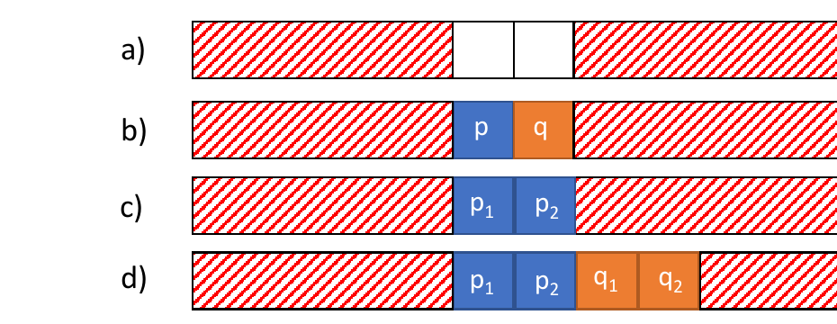

# llvmmem-oopsla18.pdf 5-8페이지 한국어 번역

하지만 이러한 종류의 동치성 전파는 GVN이 일상적으로 수행하는 작업이다. 실제로 GVN이 수행한 이와 유사한 변환이 부록 B에 나온 Rust 코드를 오컴파일한 원인이었다.

## 2.4 와일드카드 기원 정보
앞선 메모리 모델은 저수준 연산을 지원하고 고수준 메모리 최적화를 가능하게 한다는 장점이 있다. 하지만 이제 정수 변수도 기원 정보를 지니므로, 일부 정수 최적화가 건전하지 않게 된다. 이 문제를 해결하는 한 가지 방법은 다음과 같이 정수 변수에서 기원 정보를 제거하는 것이다.

```c
char *p = malloc(4);           // (val=0x10, obj=p)
char *q = malloc(4);           // (val=0x14, obj=q)
int v = (int)p + 4;            // (val=0x14)
int w = (int)q;                // (val=0x14)

if (v == w) {
    char *r = (int*)w;         // (val=0x14, obj=*)
    *r = 2;
}
```

앞 절의 예제와 다른 점은 (1) 정수는 오직 수치 값만 지닌다는 점, 그리고 (2) 정수에서 캐스팅해 얻은 포인터는 임의의 객체(여기서는 `*`로 표시됨)에 접근할 수 있다는 점이다. 따라서 `v`와 `w`는 서로 바꾸어 쓸 수 있고, 정수에 대한 GVN은 다시 건전해진다. 그러나 이 모델에는 큰 단점이 있다. 컴파일되는 프로그램이 정수에서 포인터로의 캐스트를 단 한 번이라도 수행하는 순간, 정밀한 alias 분석이 매우 어려워진다. 다음 절들에서는 이 정밀도를 어떻게 회복할 수 있는지 살펴본다.

## 2.5 inbounds 포인터
앞 절에서는 와일드카드 기원 정보가 있는 모델을 제시했다. 이 모델은 동작은 하지만 정밀한 alias 분석을 방해한다. 이 절에서는 포인터 산술이 선택적으로 `inbounds`가 되는 LLVM의 현재 모델을 설명한다. 이 모델은 범위를 벗어난 포인터 산술을 정의되지 않은 것으로 만듦으로써 일부 정밀도를 회복하게 해준다.

```c
char *p = malloc(4); // (val=0x10, obj=p)
char *q = foo(p);    // (val=0x13, obj=p)
char *r = q +inb 2;  // poison: 0x15는 p의 범위를 벗어남

p[1] = 0;
*r = 1;                    // UB
print(p[1]);               // 0 또는 1을 출력?
```

`inbounds` 포인터 산술(`+inb`)을 할 때는 기반 포인터와 결과 포인터가 같은 객체의 경계 안에 있어야 한다(혹은 그 끝 바로 다음 한 칸이어야 한다). `r`은 이 조건을 만족하지 않으므로, 그 연산 결과는 `poison`이 되고, 이 포인터를 역참조하면 UB가 된다 [LangRef 2018].

컴파일러가 `q`의 값을 모르더라도, `inbounds` 포인터 산술 때문에 이제 `r`의 최소 오프셋이 2여야 한다는 사실은 알 수 있다. 왜냐하면 `q`와 `r`은 둘 다 같은 객체의 경계 안에 있어야 하기 때문이다(즉 `0 ≤ o_q ≤ n` 그리고 `0 ≤ o_r ≤ n`, 여기서 `o_q`와 `o_r`은 각각 객체 내부에서 `q`와 `r`의 오프셋이고, `n`은 객체 크기다). `p[1]`에 대한 접근은 객체의 오프셋 1에만 접근하고, `*r`은 오프셋 2 이상에만 접근할 수 있으므로, 컴파일러는 이 두 접근이 alias하지 않는다고 결론 내릴 수 있다(즉 프로그램은 항상 0을 출력한다).

## 3 LLVM을 위한 메모리 모델
이 절에서는 다음과 같은 수정된 IR 수준 메모리 모델을 비형식적으로 설명한다. 이 모델은 저수준 코드를 계속 지원하면서도 고수준 최적화를 가능하게 하고, 포인터 산술 명령의 이동을 제한하지 않으며(즉 이 명령들은 순수 함수로 남는다), 표준적인 정수 최적화를 전혀 방해하지 않는다. 4절에서는 이 새 모델을 형식화한다.

### 3.1 지연 경계 검사
LLVM의 현재 `inbounds` 포인터 검사의 단점은 포인터 산술 명령과 할당 함수의 재배치를 막는다는 점이다.

```c
char *p = malloc(4);        // (val=0x10, obj=p)
char *q = malloc(4);        // (val=0x14, obj=q)

char *r = (char*)((int)p + 5); // (val=0x15, obj=*)
char *s = r +inb 1;            // poison: 0x15는 p의 범위를 벗어남
*s = 0; // 정상
```

이 예제에서 `s`는 유효한 포인터다. 즉, 어떤 객체의 경계 안에 있다. 하지만 `r`과 `s`의 정의를 `q`의 정의 앞쪽으로 옮기면, `s`는 범위를 벗어나게 되고 따라서 `poison`이 할당된다.²

명령의 이동을 제약하는 것은 바람직하지 않다. code hoisting 같은 최적화를 방해하기 때문이다. 실제로 LLVM은 포인터 산술 명령을 자유롭게 이리저리 이동시킨다. 이것은 건전하지 않다. 우리의 새 모델은 LLVM의 현재 즉시 경계 검사(immediate bounds checking)와 달리 지연 경계 검사(deferred bounds checking)를 사용함으로써 이 문제를 해결한다.

지연 경계 검사에서는 범위를 벗어난 포인터가 생성되고 조작되는 것을 허용한다. 정의되지 않은 동작은 그런 포인터가 역참조될 때에만 발생한다. 이제 앞선 예제에서는 포인터 산술을 할당 함수 너머로 재배치해도 괜찮다.

```c
char *p = malloc(4);                    // (val=0x10, obj=p)

char *r = (char*)((int)p + 5);          // (val=0x15, obj=*)
char *s = r +inb 1;                     // (val=0x16, obj=*, inb={0x15,0x16})

char *q = malloc(4);                    // (val=0x14, obj=q)

*s = 0; // 0x15와 0x16이 같은 객체의 경계 안에 있으므로 정상
```

이제 `obj=*`인 포인터에 대해서는, 그 포인터가 역참조될 때 반드시 같은 객체의 경계 안에 있어야 하는 주소들의 집합을 추적한다. `inbounds` 포인터 산술 연산이 일어날 때마다, 우리는 `inb` 필드에 기반 포인터와 결과 포인터를 모두 기록한다. 메모리 접근 연산은 `inb` 안의 주소들이 모두 같은 객체의 경계 안에 있지 않다면 UB다. 따라서 `inbounds` 검사는 포인터가 역참조될 때까지 미뤄진다. 지연 경계 검사는 즉시 경계 검사와 같은 효과를 달성하면서도, 포인터 산술 명령이 이제 메모리 상태에 의존하지 않기 때문에 자유롭게 이동할 수 있게 해 준다.

정밀도를 더 높이는 방법도 있을 수 있다. 예를 들어 `*` 기원 정보를 캐스트된 포인터가 실제로 가리키는 객체(들)로 대체하는 것이다. 위 첫 번째 예제에서는 `r`을 대신 `(val=0x15, obj=q)` 값을 갖도록 정의할 수 있다. 그러나 이것 또한 같은 이동 제약을 갖는 즉시 경계 검사의 한 형태다. 게다가 예제에서의 `0x14`처럼 어떤 주소는 두 객체의 경계 안에 동시에 들어갈 수도 있다(`p + 4`와 `q`에 해당). 이는 모델을 더 복잡하게 만든다. 따라서 우리는 그런 의미론을 사용하지 않는다.

² 이 예제는 데이터 흐름 기반 기원 정보 추적을 사용하는 메모리 모델에서는 올바르지 않지만, 우리 모델에서는 괜찮다는 점에 유의하라. `p`를 바탕으로 `q` 안을 가리키는 포인터를 만들고 있긴 하지만, 이것은 컴파일러가 `p == q + 4`라는 등식을 전파한 결과일 수도 있다.

### 3.2 주소 추측 방지
이 절에서는 트윈 할당(twin allocation)을 소개한다. 이는 데이터 흐름 기반 기원 정보 추적 없이도 우리 모델이 프로그램의 객체 주소 추측을 막을 수 있게 해 주는 기법이다.

와일드카드 기원 정보의 문제는, 정수로부터 만들어진 포인터가 어떤 객체든 접근할 수 있다는 점이다. 그 결과 프로그램은 임의의 객체의 주소를 추측해 접근할 수 있게 될 수도 있다. 이는 정밀한 alias 분석을 매우 어렵게 만든다.

추측을 막는 한 가지 단순한 아이디어는, 할당 함수가 비결정적인 값을 반환한다는 사실을 활용하는 것이다.

```c
char *p = malloc(4); // (val=*, obj=p)
char *q = 0x10;
*q = 0; // val(p) != 0x10 이면 UB
```

이 프로그램은 `malloc`이 `0x10`을 반환하는 실행에서는 `p`의 주소를 추측할 수 있다. 하지만 프로그램이 `p`의 주소를 맞히지 못하는 실행도 적어도 하나는 존재한다(예를 들어 `malloc`이 `0x20`을 반환하는 경우). 그 경우 이 프로그램은 UB를 일으킨다. 적어도 하나의 실행에서 프로그램이 UB를 일으킨다면, 컴파일러는 `q`가 `p`와 alias할 수 없다고, 더 나아가 어떤 객체와도 alias할 수 없다고 가정할 수 있다.

비결정적 할당이 있더라도, 프로그램은 여전히 어떤 객체의 주소를 관찰할 수 있고, 그렇게 되면 정수에서 캐스팅하여 만든 포인터가 그 객체와 alias할 수 있게 된다. 예를 들어 다음과 같다.

```c
char *p = malloc(4); // (val=*, obj=p)
*p = 0;
int v = 0x10;
if ((int)p == v)
    *(int*)v = 1;
print(*p); // 0 또는 1을 출력할 수 있음
```

이 프로그램은 잘 정의되어 있으며, `malloc`의 반환값에 따라 0 또는 1을 출력할 수 있다. 비교 연산만으로도 프로그램은 객체 `p`의 주소를 관찰하게 되므로, `*(int*)v = 1`은 어떤 실행에서도 UB를 일으키지 않는다.

하지만 이 의미론에도 한 가지 허점이 있다. 이 의미론은 프로그램이 “side-channel leak”를 통해 주소를 추측할 수 있게 해 준다. 이 누수는 메모리에 새 객체를 할당할 수 있는 주소가 단 하나만 남았을 때 발생한다. 예를 들어, 어떤 시스템이 8비트 힙 세그먼트와 8비트 포인터를 가지고 있고, 힙 주소 `0x00`이 합법적이며, 아래 할당들이 모두 성공한다고 가정하자.

```c
char *p = malloc(0x80);
char *q = malloc(0x80);

*q = 0;
int v = ((int)p == 0x00) ? 0x80 : 0x00;
*(char*)v = 1;

print(*q); // 1을 출력
```

각 힙 셀이 주소 공간의 절반 크기이므로, 가능한 힙 구성은 `p-first`와 `q-first` 두 가지뿐이다. 따라서 단 한 번의 테스트만으로도 프로그램은 `q`의 주소를 명시적으로 관찰하지 않고도 맞혀낼 수 있다. 즉, 메모리가 유한할 때는 할당 함수가 비결정적인 값을 반환하는 것만으로는 프로그램의 주소 추측을 막기에 충분하지 않다.



그림 3. 메모리 구성: (a) 두 바이트만 남아 거의 꽉 찬 상태, (b) (a)에서 `p`와 `q`를 할당한 뒤의 상태, (c) (a)에서 트윈 할당 의미론으로 `p`를 할당한 뒤의 상태, (d) 트윈 할당이 두 객체 모두에 대해 충분한 공간을 가졌던 대안적 구성.

우리의 해법은, 실제 런타임 구현에서 그러듯이, 할당 함수가 하나의 블록이 아니라 적어도 두 개의 블록을 예약하도록 바꾸는 것이다. 우리는 이 기법을 트윈 할당이라고 부르며, 프로그램이 객체의 주소를 추측할 수 없다는 개념을 형식화하는 데 이것을 사용한다.

트윈 할당의 개념은 다음 예제로 비형식적으로 설명할 수 있다.

```c
char *p = malloc(1);
char *q = malloc(1);

*q = 0;
int v = (int)p + 1;           // q와 같은가?
*(char*)v = 1;

print(*q); // 0 또는 1을 출력?
```

`q`의 주소는 관찰되지 않았으므로, 우리는 컴파일러가 이 프로그램은 오직 0만 출력할 수 있다고 결론 내릴 수 있기를 바란다. 그러나 앞에서 보았듯이 메모리가 가득 차 있으면, 한 객체의 주소를 관찰하는 것만으로도 다른 객체의 주소가 암묵적으로 드러날 수 있다. 그림 3(a)는 할당 전에 가능한 메모리 구성 하나를 보여 주고, (b)는 `p`와 `q`를 할당한 뒤의 구성을 보여 준다.

트윈 할당에서는 각 할당 함수가 적어도 두 개의 블록을 예약한다. 비결정적으로 그중 하나의 블록이 사용되고 그 주소가 반환되며, 나머지 블록들은 도달 불가능한 것으로 표시된다(즉, 그 메모리 영역에 접근하면 UB다). 두 개의 블록을 예약함으로써, 메모리가 가득 차 있더라도 프로그램이 어떤 블록의 주소를 추측할 수 없을 만큼의 비결정성이 남아 있음을 보장한다.

그림 3(c)는 트윈 할당을 사용하면 앞선 예제가 단순히 메모리 부족에 걸리게 되고, 따라서 프로그램이 계속 실행되어 `q`의 주소를 추측하려고 시도할 수 없음을 보여 준다. (d)는 남은 공간이 각 할당마다 두 블록씩 할당하기에 딱 충분했던 또 다른 메모리 구성을 보여 준다. 객체마다 두 블록이 있으므로 `malloc`은 여전히 두 주소 중 하나를 비결정적으로 반환할 수 있고, 이는 프로그램이 객체의 주소를 추측하는 것을 효과적으로 막는다. 프로그램이 가령 `p1`의 주소를 추측할 수 있다고 하더라도(심지어 `p2`까지도), 남아 있는 주소들 가운데 어느 것이 `q`를 가리키는지는 추측할 수 없다. 즉 `q1`과 `q2` 중 어느 것이 실제로 사용되었는지 알 수 없기 때문이다.

### 3.3 요약
우리는 LLVM IR을 위한 메모리 모델을 비형식적으로 제시했다. 고수준 최적화와 저수준 코드를 모두 지원하기 위해, 우리는 포인터를 두 범주로 나눈다. 첫째는 할당 지점에서 파생되는 논리 포인터(logical pointers)로, 이에 대해서는 데이터 흐름 의존성 추적을 수행한다. 즉, `p`에서 포인터 산술 연산으로 얻어진 포인터 `q`(예: `q = p + x`)는 `p`와 같은 객체에만 접근할 수 있다. 둘째는 정수에서 포인터로의 캐스트로부터 파생되는 물리 포인터(physical pointers)로, 이에 대해서는 데이터 흐름 의존성 추적을 수행하지 않는다. 그렇게 하면 등가성 전파 같은 표준 정수 최적화가 막히기 때문이다. 대신 우리는 정밀도를 회복하기 위해 두 가지 새로운 기법을 사용한다. 지연 경계 검사(포인터가 가리킬 수 있는 객체 집합을 제한하면서도 포인터 산술 연산은 순수하게 유지하기 위해)와 트윈 메모리 할당(주소 추측을 방지하기 위해)이다.
