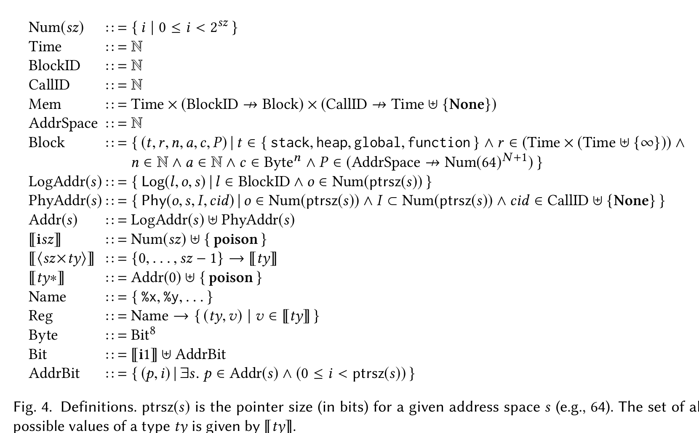
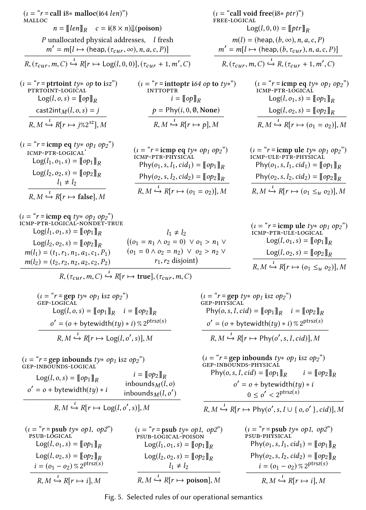

# llvmmem-oopsla18.pdf 9-12페이지 한국어 번역

앞 페이지에서 이어짐:

우리는 이에 대해 데이터 흐름 의존성 추적을 수행하지 않는데, 그렇게 하면 등가성 전파 같은 표준 정수 최적화가 막히기 때문이다. 대신 우리는 정밀도를 회복하기 위해 두 가지 새로운 기법을 사용한다. 지연 경계 검사(포인터 산술 연산을 순수하게 유지하면서 포인터가 가리킬 수 있는 객체 집합을 제한하기 위한 것)와 트윈 메모리 할당(주소 추측을 방지하기 위한 것)이다.

## 4 의미론과 변환
이 절에서는 3절에서 비형식적으로 제시한 LLVM용 수정 메모리 모델을 형식적으로 제시한다. 우리의 최상위 설계 목표는 정수와 포인터 사이의 캐스팅처럼 C와 C++에 필요한 저수준 연산을 지원하면서도, 동시에 고수준 메모리 최적화도 가능하게 하는 것이었다. 추가 목표는 다음과 같았다. 정수 최적화를 방해하지 않을 것, 코드 이동 기회를 제한하지 않을 것, LLVM이 새로운 모델을 따르도록 만드는 데 큰 변화가 필요하지 않을 것, 마지막으로 컴파일 시간과 생성 코드 품질에서 의미 있는 퇴보를 피할 것.

## 4.1 논리 포인터와 물리 포인터
2.4절에서 보았듯이, 우리는 두 종류의 포인터를 갖는다. 논리 포인터는 할당 함수를 호출하거나, 논리 포인터에 대해 포인터 산술을 수행함으로써 얻어진다. 2.4절에서는 이것이 하나의 객체에 대한 기원 정보를 갖는 포인터, 예를 들어 `(val=0x10, obj=p)`에 해당한다. 두 번째 종류의 포인터는 물리 포인터인데, 이는 정수에서 포인터로의 캐스트 결과다. 2.4절에서는 이것이 와일드카드 기원 정보를 가진 포인터, 예를 들어 `(val=0x10, obj=*)`에 해당하며, 임의의 객체에 접근할 수 있다.

그림 4는 우리 모델의 정의를 보여 준다. 논리 포인터와 물리 포인터는 각각 `Log(l, o, s)`와 `Phy(o, s, I, cid)`로 표현된다.



그림 4. 정의들. `ptrsz(s)`는 주어진 주소 공간 `s`에 대한 포인터 크기(비트 단위, 예를 들어 64)를 의미한다. 타입 `ty`의 가능한 모든 값의 집합은 `ty`로 주어진다.

### 논리 포인터
논리 포인터 `Log(l, o, s)`는 논리 블록 식별자 `l`, 그 블록 내부의 오프셋 `o`, 그리고 해당 포인터가 속한 주소 공간 `s`로 이루어진다(주소 공간은 나중에 4.2절에서 설명한다). 논리 포인터는 물리 기계 위의 주소 `P + o`에 대응하는데, 여기서 `P`는 블록 `l`의 기준 주소다.

논리 포인터는 어떤 객체에서 파생된 포인터는 결코 다른 객체를 수정하는 데 사용될 수 없다는 규칙을 구현한다. 이것은 `l`의 값을 바꾸는 것이 불가능하도록 만듦으로써 달성된다. 포인터 산술은 오직 오프셋 `o`에만 영향을 미친다.

### 물리 포인터
2.4절에서 보았듯이, 정수에서 포인터로의 캐스트로 얻은 포인터에서 객체를 추적하는 것은 적절하지 않다. 이유는 (1) 어떤 주소는 여러 객체의 경계 안에 동시에 들어갈 수 있고, (2) 그렇게 하면 명령 재배치가 막히기 때문이다. 따라서 우리는 물리 포인터를 도입한다. 이것은 대략 평면 메모리 모델의 포인터에 해당한다.

물리 포인터 `Phy(o, s, I, cid)`는 주소 공간 `s` 안의 오프셋 `o`(즉 물리 주소)로 구성되며, 여기에 포인터가 접근할 수 있는 객체들의 집합을 제한하기 위한 추가 필드 `I`와 `cid`가 더해진다. 이를 통해 우리는 alias 분석의 정밀도를 회복할 수 있고, C와 C++ 표준이 허용하는 여러 최적화도 가능하게 된다. 필드 `I`는 3.1절에서 지연 경계 검사를 명세할 때 사용했던 `inb` 필드에 해당하는 물리 주소 집합이다. 포인터가 역참조될 때, `I` 안의 각 주소는 `o`와 동일한 객체의 경계 안에 있어야 한다. 필드 `cid`는 호출 식별자(call id)로, 이 포인터가 함수 인자로 전달되었을 때의 타임스탬프에 해당하며, 그 기원이 인자가 아니면 `None`이다. 그 목적은 함수 인자로 받은 포인터는 로컬에서 할당된 객체와 alias하지 않는다는 사실을 보여 주기 위함이다. 예를 들어 다음과 같다.

```c
int f(int *p) {
    int a = 0;
    if (&a == p)
        *p = 1;
    return a; // 0 또는 1을 반환?
}
```

물리 포인터는 어떤 객체든 접근할 수 있으므로, call id 제약이 없다면 이 함수는 0 또는 1 중 어느 것이든 반환할 수 있다. 하지만 `p`는 아직 호출 스택 위에 남아 있는 함수 호출의 call id를 가지고 있으므로, 그 호출 이후에 생성된 어떤 객체에도 접근할 수 없다.

포인터 안의 호출 시각 타임스탬프에 간접 참조를 두는 이유는(`cid`가 메모리 `M`을 인덱싱해 타임스탬프를 가져옴), 탈출하는 포인터(escaping pointers)를 지원하기 위해서다. 탈출한 물리 포인터는 함수 호출이 종료된 뒤에는 `cid`가 `None`인 것처럼 동작해야 한다. 이렇게 하면 함수 호출들을 다른 함수 호출들 너머로 이동시키는 것이 가능해진다. 어떤 함수가 인자로 받은 포인터를 전역 변수에 저장한다고 할 때, 우리는 그 사실을 따로 기록해 두었다가 함수가 반환될 때마다 그런 포인터들을 모두 바꾸고 싶지 않았다. 이 방식에서는 함수가 반환할 때 `cid`와 타임스탬프 사이의 매핑만 바꾸면 된다(`None`으로 설정하면 된다).

## 4.2 주소 공간
LLVM은 서로 구별되는 메모리들을 표현하기 위해 주소 공간(address spaces)을 사용하며, 우리의 메모리 모델도 이 기능을 지원한다. 예를 들어 어떤 기계는 CPU를 위한 주소 공간 하나와 GPU를 위한 주소 공간 하나를 사용할 수 있고, 혹은 코드용 주소 공간 하나와 데이터용 주소 공간 하나를 사용할 수도 있다. 두 메모리가 주소 범위를 서로 겹쳐 사용할 수 있으므로(예를 들어 둘 다 `[0, 2^64)` 범위의 주소를 사용할 수 있다), 포인터 안의 주소 공간 필드는 두 메모리를 구별하기 위해 사용된다.

CPU의 주 메모리에는 주소 공간 0이 할당된다. 하나의 물리 메모리 영역이 여러 주소 공간에 매핑되는 경우도 가능하다. 이런 경우 응용 프로그램은 주소 캐스트 명령을 사용해 주소 공간 사이에서 포인터를 변환할 수 있다.

주소 공간이 겹칠 수 있다는 사실의 결과로, 서로 다른 주소 공간에 속하는 포인터들도 alias할 수 있다. alias 분석의 정밀도를 높이기 위해, 우리는 이 겹침 관계를 매개변수로 갖는 모델을 사용한다.



그림 5. 우리 연산 의미론의 일부 규칙들.

## 4.3 메모리 블록
우리는 메모리 `M = Time × (BlockID ↛ Block) × (CallID ↛ Time ⊎ {None})`를 다음 세 요소로 이루어진 튜플로 정의한다. 하나는 타임스탬프이고, 하나는 논리 블록 식별자에서 메모리 블록으로 가는 맵이며, 마지막 하나는 각 함수 호출의 타임스탬프를 기록하는 맵이다(이 맵은 물리 포인터의 `cid`로 인덱싱된다). 새로운 메모리 블록이 생성되거나(예: `malloc`, `alloca`) 해제될 때마다 타임스탬프는 1 증가한다.

메모리 블록은 `(t, r, n, a, c, P)`라는 튜플이다. 여기서 `t`는 블록 타입(예: 스택 할당 또는 힙 할당), `r`은 블록의 생존 구간(life range), `n`은 바이트 단위의 블록 크기, `a`는 정렬(alignment), `c`는 블록의 내용(실제 데이터), 그리고 `P`는 블록의 주소들을 담는다.

블록이 해제될 때(예: `free`를 호출하거나 함수가 끝날 때), 그 블록은 메모리에서 삭제되지 않는다.³ 대신 생존 구간의 끝을 현재 메모리 타임스탬프로 설정하고, 타임스탬프도 함께 증가시킨다. 그림 5의 `free-logical`은 `free`의 의미론을 보여 준다. 만약 물리 포인터 `Phy(o, s, I, cid)`가 `free`에 주어지면, 이는 기준 주소가 `o`인 역참조 가능한 블록을 해제하는 것과 같다. 블록을 이중 해제하는 경우, 혹은 0이 아닌 오프셋을 가진 논리 포인터로 `free`를 호출하는 경우는 UB다. `NULL`에 대한 `free`는 no-op이다.

메모리 할당 함수는 적어도 두 개의 블록을 예약한다. 프로그램이 실제로 관찰하는 블록 하나와, 추가적인 `N`개의 트윈 블록들이다. 트윈 블록 수 `N`은 의미론의 매개변수다. (4.12절에서 왜 `N = 1`로는 충분하지 않을 수 있는지 논의할 것이다.) 블록의 기준 주소들은 주소 공간 `s`에 대해 `P(s)`에 저장되는데, 이는 물리 주소들의 수열이다. `P(s)_0`는 프로그램이 실제로 사용하고 관찰하는 기준 주소이고, 나머지 주소들은 트윈 블록들의 기준 주소다.

결정적으로, 우리는 살아 있는(아직 해제되지 않은) 서로 다른 두 블록의 임의의 쌍에 대해, 그 주소 범위 `[P(s)_i, P(s)_i + n)`과 `[P'(s)_j, P'(s)_j + n)`이 서로 겹치지 않는다는 불변식을 유지한다. 따라서 `malloc`은 블록 자체와 그 트윈들을 모두 위한 공간을 예약한다(그림 5). 의미론의 나머지 부분은 오직 `P(s)_0`에만 의존하며, 나머지 기준 주소들은 무시한다.

그림 5에서 `op_R` 표기는 명령의 피연산자를 평가한 결과를 나타낸다.

```text
vR =
    R(v)    if v is a register
    v       if v is a constant or v = poison
```

즉 `v`가 레지스터면 `R(v)`이고, 상수이거나 `v = poison`이면 그대로 `v`다.

## 4.4 포인터 산술
LLVM IR에는 포인터 산술을 위한 명령이 하나만 있는데, `getelementptr`, 줄여서 `gep`이다. 그림 5는 여러 경우의 의미론을 보여 준다. 논리 포인터의 경우 결과 역시 논리 포인터이며, 오직 오프셋만 갱신된다(`gep-logical`). 물리 포인터의 경우도 마찬가지다(`gep-physical`).

함수 `inbounds_M(l, o)`는 주어진 오프셋 `o`가 메모리 `M = (τ, m, C)`에서 객체 `l`의 경계 안에 있는지를 검사한다. 만약 `m(l) = (t, r, n, a, c, P)`라면, `inbounds_M(l, o)`는 `0 ≤ o ≤ n`일 때이자 그때에만 참이다.

`gep`가 `inbounds` 태그를 갖는 경우(예를 들어 C/C++ 코드를 컴파일할 때나, 안전한 언어의 대부분 경우), 컴파일러는 입력 포인터가 유효하다고, 즉 어떤 객체의 경계 안에 있거나 아니면 그 끝 바로 다음 한 요소를 가리킨다고 가정할 수 있으며, 결과 포인터도 유효하다고 가정할 수 있다. 논리 포인터의 경우 경계 검사는 즉시 수행된다(`gep-inbounds-logical`). 두 `inbounds` 조건 가운데 하나라도 실패하면 결과는 `poison`이다(그 규칙은 그림에는 나오지 않는다).

포인터가 물리 포인터라면, 우리는 지연 경계 검사를 사용한다. 입력과 출력 오프셋은 `I`에 추가된다. 이 값들은 포인터가 역참조될 때에만 `inbounds`인지 검사된다. 3.1절에서 보았듯이, 이것은 `gep` 명령들이 메모리 상태에 의존하지 않기 때문에 자유롭게 이동할 수 있게 해 준다.

³ 메모리는 물론 실행 시점에 예상대로 해제된다. 또한 우리의 의미론에서는 주소가 재사용될 수 있는데, 이는 할당 함수가 다른 모든 살아 있는 블록들과만 주소가 겹치지 않도록 블록을 할당하기 때문이다.
